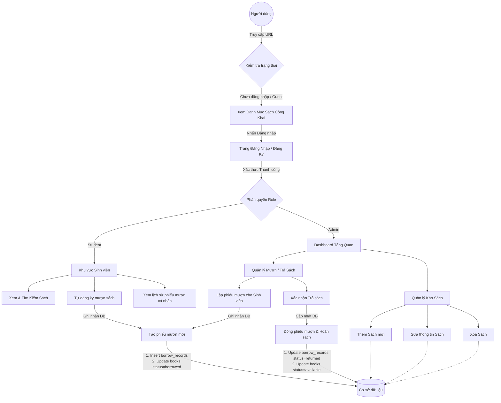

# Luồng Nghiệp vụ - Hệ thống Quản lý Thư viện HCMUE

## Sơ đồ Luồng Nghiệp vụ

## Tóm tắt Luồng Nghiệp vụ

### 🔐 Luồng Xác thực
- Người dùng đăng nhập bằng tài khoản
- Xác thực quyền (Admin hoặc Sinh viên)
- Vào Dashboard tương ứng

### 👨‍💼 Luồng Admin
- **Quản lý Sách**: Thêm/Sửa/Xóa/Xem sách
- **Quản lý Người dùng**: Xem danh sách, quản lý quyền
- **Xem Báo cáo**: Thống kê sách, giao dịch

### 👨‍🎓 Luồng Sinh viên

**Mượn sách:**
1. Tìm kiếm → Chọn sách
2. Nếu sách còn → Tạo BorrowRecord (Status: borrowed)
3. Cập nhật số lượng sách (Quantity - 1)
4. Xác nhận mượn thành công

**Trả sách:**
1. Xem danh sách sách đang mượn
2. Nhấn trả → Cập nhật BorrowRecord (Status: returned)
3. Cập nhật số lượng sách (Quantity + 1)
4. Xác nhận trả thành công

**Xử lý quá hạn:**
- Hệ thống kiểm tra ngày trả
- Nếu quá hạn → Status: overdue

## Các thành phần liên quan

### Controllers (Điều khiển)
- `AuthController` - Xử lý đăng nhập/đăng xuất
- `DashboardController` - Hiển thị dashboard
- `BookController` - Quản lý sách
- `UserController` - Quản lý người dùng (Admin)
- `TransactionController` - Quản lý giao dịch mượn/trả

### Services (Dịch vụ)
- `CirculationService` - Xử lý logic mượn/trả sách

### Models (Dữ liệu)
- `User` - Thông tin người dùng
- `Book` - Thông tin sách
- `BorrowRecord` - Ghi nhận mượn/trả

### Database Tables
- `users` - Danh sách người dùng (role: admin, student)
- `books` - Danh sách sách (status: available, borrowed, unavailable)
- `borrow_records` - Ghi nhận mượn/trả (status: borrowed, returned, overdue)
