# ĐẶC TẢ YÊU CẦU PHẦN MỀM (SOFTWARE REQUIREMENT SPECIFICATION - SRS)
## HỆ THỐNG QUẢN LÝ THƯ VIỆN HDPE

---

## 1. Giới thiệu (Introduction)

### 1.1. Mục đích
Tài liệu này đặc tả toàn bộ các yêu cầu nghiệp vụ, yêu cầu chức năng, yêu cầu phi chức năng, và cấu trúc kiến trúc dữ liệu cho hệ thống **Quản lý Thư viện HDPE**. Tài liệu được biên soạn nhằm hướng dẫn chi tiết cho đội ngũ phát triển phát triển mã nguồn, đội ngũ kiểm thử (QA/QC) xây dựng kịch bản kiểm thử (test cases), và làm tài liệu bàn giao dự án.

### 1.2. Phạm vi sản phẩm
Sản phẩm là một ứng dụng Web (Web Application) được xây dựng trên nền tảng PHP (sử dụng Laminas Framework). Ứng dụng cung cấp các công cụ trực tuyến phục vụ:
*   Đăng ký, xác thực tài khoản qua OTP email và Google Login.
*   Quản lý vòng đời sách (Nhập sách, tra cứu, hiển thị trạng thái tồn kho).
*   Động cơ quản lý mượn/trả sách tự động với các quy tắc kiểm tra quá hạn, hạn mức mượn và khóa tài khoản phạt.
*   Bảng tin chung hỗ trợ thả cảm xúc thời gian thực (Real-time reactions).
*   Trung tâm hỗ trợ và gửi yêu cầu hỏi đáp hỗ trợ (Support Ticket).
*   Giao diện responsive tương thích đa thiết bị, hỗ trợ giao diện tối (Dark mode) hiện đại.

### 1.3. Định nghĩa và từ viết tắt
*   **SRS**: Software Requirement Specification (Đặc tả yêu cầu phần mềm).
*   **OTP**: One-Time Password (Mật khẩu dùng một lần).
*   **CSPRNG**: Cryptographically Secure Pseudo-Random Number Generator (Bộ sinh số ngẫu nhiên giả an toàn mật mã).
*   **OAuth2**: Giao thức ủy quyền bảo mật phổ biến để đăng nhập bằng Google.
*   **Circulation**: Nghiệp vụ lưu thông sách (Mượn, Trả, Gia hạn, Phạt).

### 1.4. Tài liệu tham khảo
*   Laminas Framework Documentation (MVC & Database DB Component).
*   IEEE Std 830-1998 - Khuyến nghị thực hành cho Đặc tả yêu cầu phần mềm.

---

## 2. Mô tả tổng thể (Overall Description)

### 2.1. Bối cảnh sản phẩm
Thư viện HDPE được triển khai trên máy chủ Apache (XAMPP địa phương hoặc máy chủ Cloud) kết nối cơ sở dữ liệu MySQL. Phần mềm đóng vai trò trung tâm kết nối giữa độc giả (Sinh viên) và thủ thư (Admin), chuyển đổi số các hoạt động thủ công của thư viện truyền thống thành các quy trình phê duyệt trực tuyến tự động và tức thời.

### 2.2. Các Vai trò và Đặc điểm người dùng (User Classes)
*   **Khách (Guest)**: Chưa đăng nhập. Chỉ có quyền truy cập trang danh mục sách công cộng để tìm kiếm thông tin và xem Bảng tin chung. Không thể thực hiện mượn sách hay đăng câu hỏi hỗ trợ.
*   **Sinh viên (Student)**: Có tài khoản hợp lệ trên hệ thống. Có quyền cập nhật hồ sơ (đặt biệt danh, đổi ảnh đại diện), đăng ký mượn sách, gia hạn sách đang mượn, tạo và phản hồi các Ticket hỗ trợ.
*   **Quản trị viên (Admin)**: Thủ thư/Chủ thư viện. Có toàn quyền quản lý kho sách (thêm, sửa, xóa, nhập file JSON/XML), quản lý thành viên (phê duyệt, khóa tài khoản phạt, mở khóa), phê duyệt hoặc từ chối phiếu mượn, đóng/mở ticket hỗ trợ và cấu hình hệ thống.

### 2.3. Môi trường vận hành (Operating Environment)
*   **Hệ điều hành**: Linux / Windows / Docker Container.
*   **Ngôn ngữ**: PHP >= 8.1.
*   **Cơ sở dữ liệu**: MySQL / MariaDB.
*   **Trình duyệt hỗ trợ**: Google Chrome, Mozilla Firefox, Microsoft Edge, Safari (yêu cầu hỗ trợ HTML5/CSS3 và Javascript).

### 2.4. Ràng buộc thiết kế và triển khai
*   Mã nguồn phải tuân thủ cấu trúc Laminas MVC, sử dụng TableGateway để truy vấn CSDL.
*   Các dịch vụ bên ngoài (SMTP Mail, Google Login) phải được quản lý thông qua trang Cấu hình hệ thống lưu trong bảng `system_settings`.
*   Giao diện thiết kế theo phong cách tối (Dark Mode) hiện đại, sử dụng CSS tùy chỉnh phối hợp kính mờ (Glassmorphism), biểu tượng Bootstrap Icons và thư viện biểu đồ Chart.js.

---

## 3. Đặc tả yêu cầu chức năng hệ thống (Detailed Functional Features)

### 3.1. Xác thực & Phân quyền (Authentication)

#### 3.1.1. Luồng đăng ký tài khoản (Register)
*   **Đầu vào**: Sinh viên cung cấp Họ tên, Tên đăng nhập, Email, Mật khẩu, Xác nhận mật khẩu.
*   **Ràng buộc mật khẩu**:
    *   Mật khẩu phải dài tối thiểu **8 ký tự**.
    *   Chứa ít nhất **1 chữ cái in hoa** (`[A-Z]`).
    *   Chứa ít nhất **1 ký tự đặc biệt** (không phải chữ và số).
*   **Kích hoạt tài khoản (Registration OTP)**: Sau khi đăng ký thành công, tài khoản ở trạng thái chưa phê duyệt (`is_approved = 0`). Hệ thống tự động tạo mã OTP 6 chữ số và gửi qua Email. Người dùng nhập đúng mã OTP để kích hoạt tài khoản sử dụng.

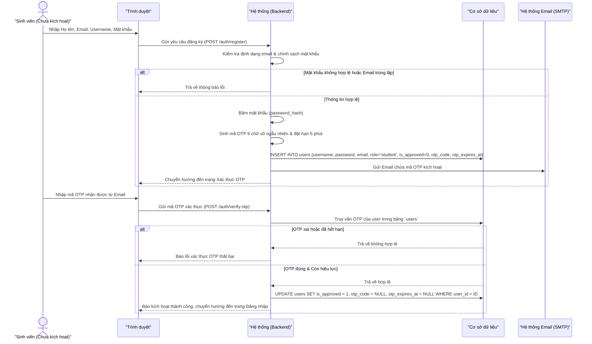

#### 3.1.2. Đăng nhập bằng Google (Google OAuth2 Login)
*   Cho phép người dùng nhấn "Tiếp tục với Google" để ủy quyền đăng nhập.
*   Hệ thống kiểm tra thông tin Google ID nhận về:
    *   Nếu Google ID đã liên kết với tài khoản trên hệ thống, thực hiện đăng nhập.
    *   Nếu email Google khớp với tài khoản thường có sẵn, tự động cập nhật liên kết Google ID và đăng nhập.
    *   Nếu chưa tồn tại, tự động tạo tài khoản Sinh viên mới ở trạng thái chờ kích hoạt OTP qua Email để đảm bảo xác minh danh tính.

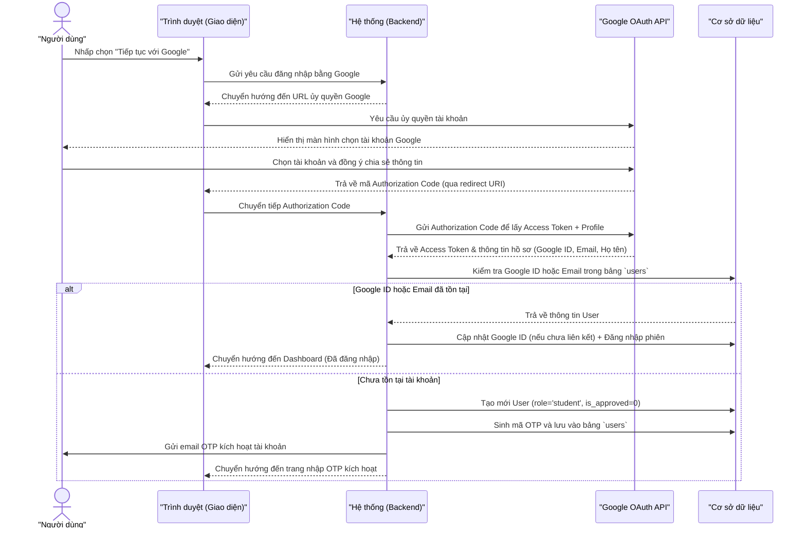

#### 3.1.3. Quên và đặt lại mật khẩu (Forgot/Reset Password)
*   **Quên mật khẩu**:
    *   Người dùng nhập Username hoặc Email. Hệ thống kiểm tra trong CSDL.
    *   Nếu khớp, tạo mã OTP 6 chữ số ngẫu nhiên (sinh bằng `random_int`), đặt thời hạn hết hạn sau **5 phút**, cập nhật vào bảng `users` và gửi email chứa mã OTP đến người dùng.
*   **Khóa Brute-Force OTP**:
    *   Hệ thống ghi nhận số lần nhập sai OTP của phiên khôi phục mật khẩu.
    *   Nếu người dùng nhập sai mã OTP **5 lần**, mã OTP đó lập tức bị hủy bỏ (xóa sạch trong CSDL), đồng thời hủy phiên khôi phục mật khẩu để bảo vệ tài khoản khỏi các cuộc tấn công dò mã tự động.
*   **Đặt lại mật khẩu**:
    *   Người dùng cung cấp mã OTP hợp lệ, Mật khẩu mới và Xác nhận mật khẩu mới.
    *   Mật khẩu mới phải tuân thủ đúng chính sách mật khẩu (dài >= 8 ký tự, 1 chữ hoa, 1 ký tự đặc biệt).
    *   **Trải nghiệm người dùng**: Cung cấp bộ chỉ thị độ mạnh mật khẩu động trực quan theo thời gian thực (Real-time dynamic strength checklist) trên giao diện đặt lại mật khẩu. Khi người dùng gõ, các điều kiện đạt chuẩn sẽ tự động đổi màu xanh lá và tích dấu hoàn thành.

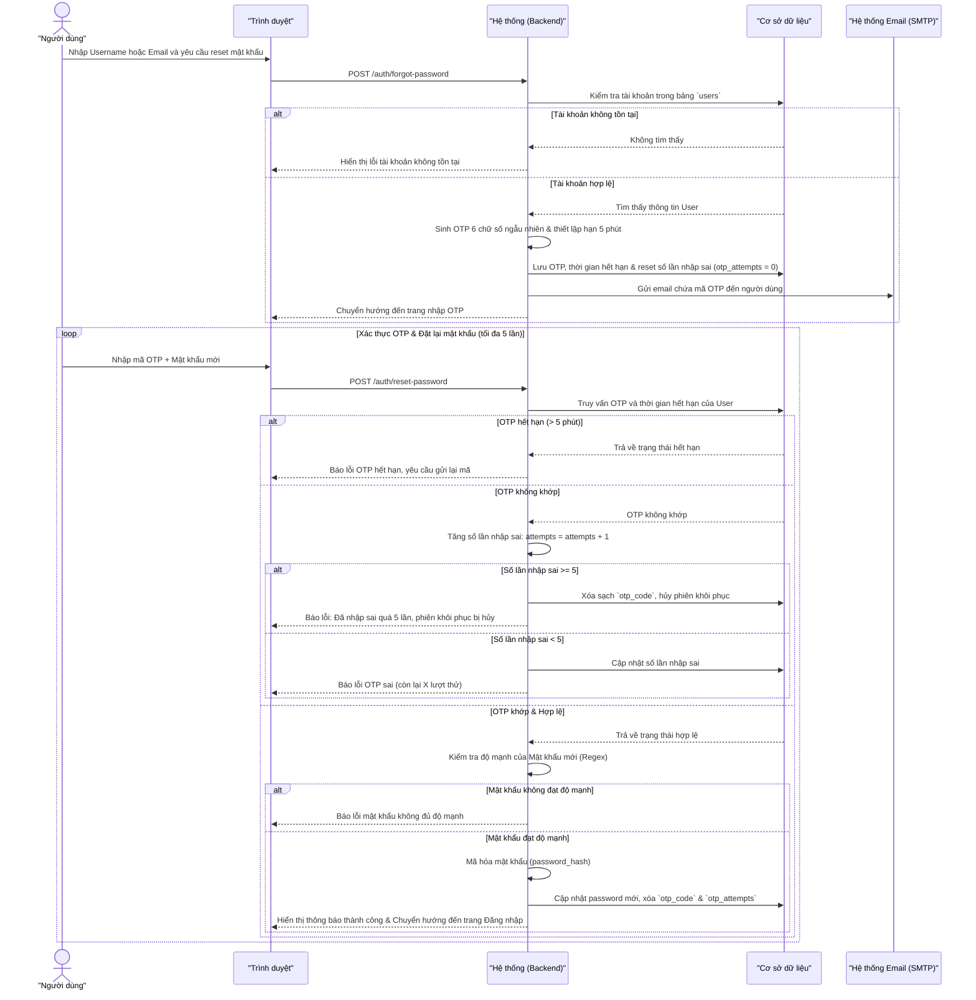

---

### 3.2. Quản lý sách & Danh mục (Book Management)

#### 3.2.1. Quy trình nhập kho sách (Book Sourcing & Importation)
Hệ thống hỗ trợ Thủ thư (Admin) thực hiện nhập kho sách qua hai hình thức:
*   **Nhập thủ công (Manual Input):** Admin nhập các thông tin chi tiết: Tên sách, Tác giả, Mã ISBN, Thể loại, Nhà xuất bản, Năm xuất bản, Hình thức nhập (`purchase` - Mua mới, `donation` - Tài trợ, `other` - Khác), Số lượng nhập, Đơn giá chi phí, Mã hóa đơn (tự sinh định dạng `INV-[UNIQUE_HASH]` nếu bỏ trống), Đường dẫn chứng từ và Ghi chú.
*   **Nhập hàng loạt qua file Excel (.xlsx):**
    *   Hệ thống cung cấp chức năng **Tải xuống Tệp tin mẫu Excel (.xlsx)** chứa tiêu đề cột chuẩn hóa.
    *   Admin điền dữ liệu và tải file Excel lên hệ thống. Hệ thống sử dụng thư viện `PhpSpreadsheet` để phân tích cú pháp tệp tin.
    *   **Logic Đối khớp Cơ sở dữ liệu (Database Syncing Rule):**
        1.  Với mỗi dòng sách trong tệp Excel, hệ thống trích xuất mã `ISBN`.
        2.  Nếu `ISBN` không trống và khớp với một cuốn sách đã tồn tại trong bảng `books`, hệ thống **cộng dồn số lượng nhập** vào trường `quantity` của cuốn sách đó và tự động cập nhật lại trạng thái sách thành `'available'`.
        3.  Nếu `ISBN` trống hoặc chưa tồn tại trong hệ thống, hệ thống tiến hành **tạo mới** một cuốn sách trong bảng `books` với số lượng tương ứng.
        4.  Đối với mỗi dòng sách nhập thành công, hệ thống ghi nhận một bản ghi hóa đơn chi tiết vào bảng `book_imports` ở trạng thái `approved` (Đã nhập kho), đồng thời lưu vết tài khoản Admin thực hiện.

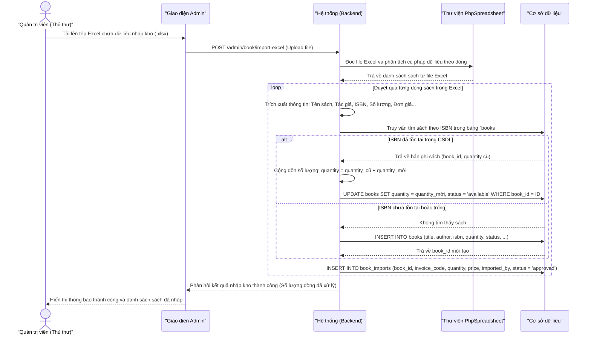

#### 3.2.2. Tra cứu & Hiển thị sách của Sinh viên
*   **Tìm kiếm & Lọc:** Sinh viên có thể tra cứu nhanh sách theo các tiêu chí: Tên sách, Tác giả, hoặc mã số `ISBN`.
*   **Quy tắc ẩn sách hết hàng (Auto-hide out-of-stock):** Những cuốn sách có số lượng bản sao khả dụng trên kệ (`quantity = 0`) sẽ **tự động bị ẩn** trên giao diện gửi yêu cầu mượn của Sinh viên. Việc này ngăn chặn triệt để độc giả gửi yêu cầu mượn những đầu sách không còn bản sao thực tế nào trong kho.

#### 3.2.3. Quản lý hóa đơn nhập & Xuất báo cáo tài chính
*   **Quản lý trạng thái:** Các hóa đơn nhập sách được phân loại theo các trạng thái: `pending` (chờ duyệt), `approved` (đã duyệt nhập kho), `rejected` (đã từ chối).
*   **Xuất báo cáo Excel (.xlsx):** Cho phép Admin kết xuất báo cáo tài chính dưới định dạng bảng tính Excel chuyên nghiệp. File xuất ra được cấu trúc thành 2 Sheet:
    -   **Sheet 1 (Chi tiết hóa đơn):** Danh sách toàn bộ các phiếu nhập kho khớp với bộ lọc (thời gian Quý/Năm, hình thức nhập), tự động tính tổng tiền cột `Thanh tien` bằng công thức `=SUM()`.
    -   **Sheet 2 (Thống kê Quý):** Bảng tổng hợp số lượng đầu sách nhập và tổng số tiền chi tiêu được gom nhóm theo 4 Quý của năm tài chính được chọn.
    -   Báo cáo được định dạng màu sắc trang nhã, căn chỉnh tự động độ rộng cột, phục vụ tốt công tác báo cáo ban giám hiệu.

#### 3.2.4. Đánh giá & Bình luận sách (Book Review System)
*   **Chức năng**: Sinh viên có thể gửi đánh giá (Rating 1-5 sao) kèm bình luận văn bản cho các cuốn sách đã hoặc đang mượn.
*   **Ràng buộc nghiệp vụ**:
    *   Chỉ Sinh viên mới có quyền đánh giá (`role = 'student'`).
    *   Sinh viên **chỉ được đánh giá sách** mà mình đã hoặc đang mượn (hệ thống kiểm tra tồn tại bản ghi trong `borrow_records`).
    *   Mỗi sinh viên chỉ được đánh giá **một lần duy nhất** cho mỗi cuốn sách (kiểm tra bảng `book_reviews`).
*   **Quản trị**: Admin có quyền xóa bất kỳ đánh giá nào vi phạm chính sách cộng đồng thông qua chức năng `deleteReviewAction`.
*   **Hiển thị**: Điểm trung bình (Average Rating) và danh sách bình luận được hiển thị trên trang chi tiết sách.

---

### 3.3. Động cơ mượn/trả sách (Circulation Engine)

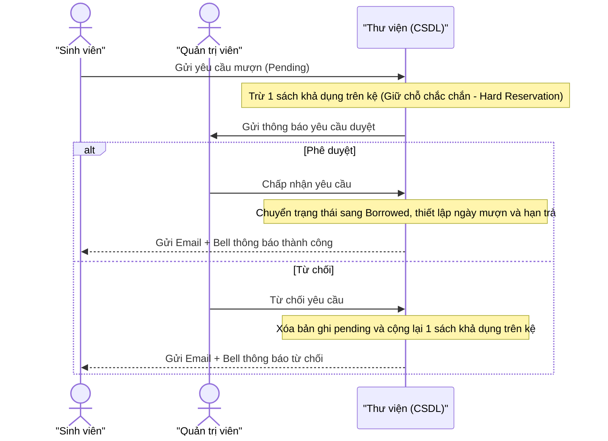

#### Quy tắc kiểm duyệt mượn trả tự động:
1.  **Hạn mức mượn (Borrow Limit)**: Mặc định mỗi Sinh viên chỉ được phép đăng ký tối đa **5 cuốn sách** ở trạng thái đang mượn (bao gồm cả phiếu `pending` đã gửi). Vượt quá hạn mức hệ thống sẽ báo lỗi và chặn tạo phiếu mượn.
2.  **Thời hạn mượn sách tối đa**: Không quá **30 ngày** kể từ ngày mượn.
3.  **Khóa do quá hạn & Xử phạt lũy tiến (Late Return Penalties)**: Sinh viên có bất kỳ một cuốn sách nào đang mượn quá hạn sẽ bị hệ thống khóa hoàn toàn chức năng mượn mới. Đồng thời, hệ thống áp dụng các hình thức xử phạt tự động sau:
    *   **Quy tắc trễ hạn quá 15 ngày (Khóa ngay lập tức)**: Nếu sinh viên có **bất kỳ một cuốn sách nào trễ hạn quá 15 ngày** (sách chưa trả bị quá hạn hơn 15 ngày dựa trên quét Cron hằng ngày, hoặc sách được trả muộn quá 15 ngày so với hạn trả tại quầy), tài khoản sinh viên đó sẽ lập tức bị **khóa vĩnh viễn** (đến ngày 31/12/9999), cập nhật hạn mức mượn (`borrow_limit`) về **0**, ghi log phạt và gửi thông báo hệ thống.
    *   **Hình phạt lũy tiến theo số lần trễ hạn (khi trả sách trễ hạn <= 15 ngày)**: Hệ thống tính tổng số lần từng trả muộn trong lịch sử của sinh viên và áp dụng các mốc phạt:
        *   **Trễ hạn 3-4 lần**: Tạm khóa tài khoản **1 ngày**, giảm hạn mức mượn (`borrow_limit`) xuống còn **4 cuốn**.
        *   **Trễ hạn 5 lần**: Tạm khóa tài khoản **3 ngày**, giảm hạn mức mượn xuống còn **2 cuốn**.
        *   **Trễ hạn 6 lần**: Tạm khóa tài khoản **7 ngày**, giảm hạn mức mượn xuống còn **1 cuốn**.
        *   **Trễ hạn từ 7 lần trở lên**: Khóa tài khoản **vĩnh viễn** (đến ngày 31/12/9999) và cập nhật hạn mức mượn (`borrow_limit`) về **0**.
4.  **Khóa do kỷ luật & Báo mất sách (Disciplinary Lock & Lost Book Workflow)**:
    *   Tài khoản bị khóa (`locked`) sẽ không thể mượn sách hay được phê duyệt phiếu mượn hiện tại.
    *   **Quy trình báo mất sách**: Khi Sinh viên hoặc Admin báo mất sách, hệ thống chuyển trạng thái phiếu mượn sang `lost`. Nếu là bản sao cuối cùng của sách đó trên kệ, trạng thái đầu sách cập nhật thành `lost`. Hệ thống tự động **khóa tài khoản sinh viên vĩnh viễn** với lý do nêu rõ tên sách đã mất (ví dụ: *Làm mất sách: 'Tên sách'.*) cho đến khi hoàn tất thủ tục đền bù, và cập nhật hạn mức mượn (`borrow_limit`) về **0**.
5.  **Cơ chế Giữ chỗ chắc chắn (Hard Reservation)**: Khi sinh viên tạo yêu cầu mượn sách ở trạng thái chờ duyệt (`pending`), hệ thống sẽ trừ ngay lập tức số lượng sách khả dụng trên kệ. Điều này đảm bảo khi Admin bấm duyệt, sách thực tế vẫn còn trên kệ cho sinh viên đó. Nếu Admin từ chối phê duyệt, hệ thống sẽ tự động cộng lại số lượng sách đó về kệ.
6.  **Hủy yêu cầu mượn đang chờ duyệt (Cancel Pending Request)**: Sinh viên được phép tự hủy yêu cầu mượn sách ở trạng thái `pending`. Khi hủy, hệ thống cộng lại số lượng sách khả dụng về kệ ngay lập tức (giải phóng Hard Reservation), xóa bản ghi mượn và gửi thông báo cảnh báo cho Admin.
7.  **Cơ chế thưởng/khích lệ khôi phục hạn mức (Borrow Limit Reward Logic)**: Nếu sinh viên đã bị giảm hạn mức mượn do trả muộn nhưng sau đó trả đúng hạn 3 cuốn liên tiếp, hệ thống sẽ tự động khôi phục hạn mức mượn của họ thêm **+1** cuốn (tối đa không quá hạn mức tiêu chuẩn là **5 cuốn**). Hệ thống cũng tự động gửi một thông báo hệ thống để chúc mừng và cập nhật thông tin hạn mức mới cho sinh viên.

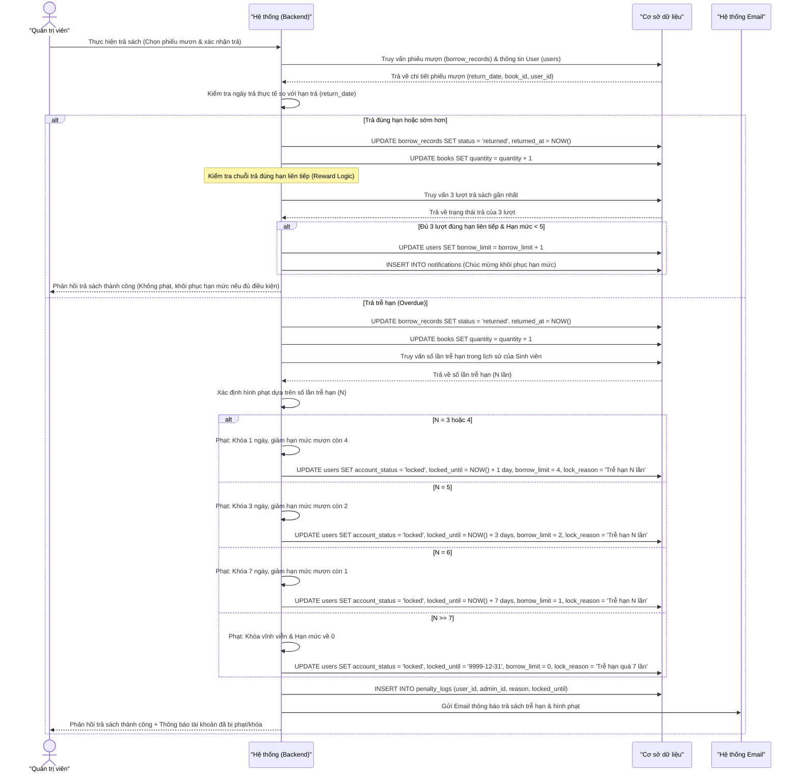

#### 3.3.1. Quy trình Gia hạn sách (Renewal Workflow)
*   **Luồng nghiệp vụ**: Sinh viên muốn gia hạn sách đang mượn phải gửi **yêu cầu gia hạn** (không tự động gia hạn). Quản trị viên sẽ xem xét và phê duyệt hoặc từ chối yêu cầu.
*   **Cơ chế hoạt động:**
    *   Sinh viên bấm nút "Gia hạn" → hệ thống đặt cờ `is_renew_pending = 1` trên bản ghi mượn và thông báo cho Admin.
    *   Admin duyệt (`approveRenewAction`): Hệ thống gia hạn hạn trả thêm 30 ngày, tăng `renew_count + 1`, đặt `is_renew_pending = 0`.
    *   Admin từ chối (`rejectRenewAction`): Hệ thống đặt `is_renew_pending = 0`, giữ nguyên hạn trả cũ.
    *   Admin cũng có thể **gia hạn trực tiếp** (bypass quy trình duyệt) cho bất kỳ phiếu mượn nào.
*   **Theo dõi trạng thái**: Trường `renew_count` trong bảng `borrow_records` ghi lại tổng số lần đã gia hạn của cuốn sách đó.

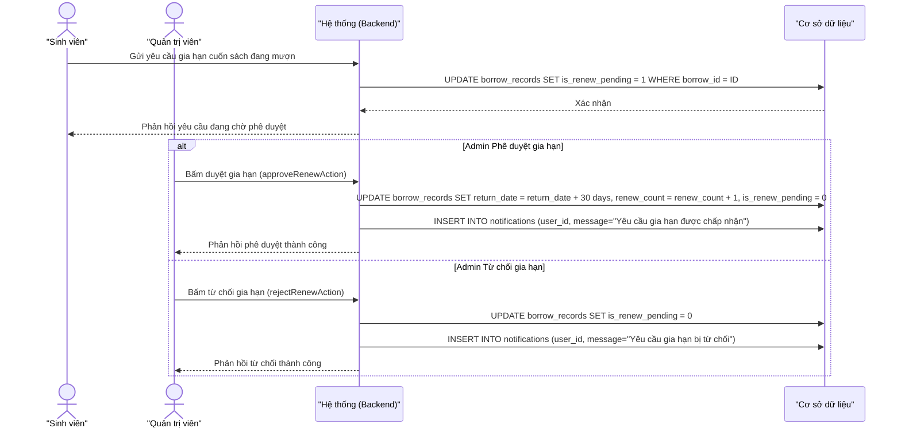

---

### 3.4. Bảng tin & Kênh thảo luận (Announcement & Public Chat)

#### 3.4.1. Quản lý Bảng tin (Announcement CRUD)
*   **Tạo bản tin**: Admin nhập Tiêu đề, Nội dung, Loại bản tin (`event` — Sự kiện, `contest` — Cuộc thi, `holiday` — Lễ, `general` — Chung), Ngày bắt đầu/kết thúc hiển thị, Trạng thái hiển thị, và có thể Upload hình ảnh đính kèm.
*   **Sửa bản tin**: Admin cập nhật toàn bộ thông tin và thay thế hình ảnh đính kèm.
*   **Xóa bản tin**: Admin xóa bản tin vĩnh viễn khỏi hệ thống.
*   **Quản lý trạng thái hiển thị**: Hệ thống phân loại tự động bản tin theo 4 trạng thái: **Đang hiển thị** (ngày hiện tại nằm trong khoảng start_date – end_date), **Sắp tới** (start_date chưa đến), **Hết hạn** (đã qua end_date), **Ẩn** (is_active = 0).
*   **Bảng xếp hạng Độc giả tích cực (Leaderboard)**: Hiển thị Top 5 độc giả mượn sách nhiều nhất trên trang bảng tin. Hỗ trợ bộ lọc khoảng thời gian: Tuần / Tháng / Quý / Năm.
*   **Tìm kiếm & Lọc (Admin)**: Admin có thể tìm kiếm bản tin theo từ khóa, lọc theo loại bản tin, trạng thái, sắp xếp theo nhiều tiêu chí (ngày tạo, tiêu đề, loại,...).
*   **Hiển thị Sinh viên/Khách**: Chỉ hiển thị các bản tin đang hoạt động (`is_active = 1` và nằm trong khoảng ngày hiển thị), cho phép lọc theo loại bản tin.

#### 3.4.2. Kênh thảo luận công khai (Public Chat)
*   **Gửi tin nhắn**: Người dùng đã đăng nhập gửi tin nhắn chat (tối đa **255 ký tự**), nội dung được kiểm duyệt AI trước khi lưu.
*   **Chặn chat đối với tài khoản bị khóa vĩnh viễn (Chat Block Policy)**: Để đảm bảo an toàn thông tin và kỷ luật, các tài khoản bị khóa vĩnh viễn (`account_status = 'locked'` và `locked_until` chứa mốc `'9999-12-31'`) sẽ **bị vô hiệu hóa hoàn toàn khả năng thảo luận**:
    - Phía giao diện (frontend) tự động ẩn ô nhập chat và thay thế bằng thông báo cảnh báo màu đỏ: `"Tài khoản của bạn đã bị khóa vĩnh viễn và bị chặn tính năng thảo luận."`
    - Phía máy chủ (backend API `chatAction` của `DashboardController`) chặn xử lý và trả về mã trạng thái HTTP `403 Forbidden` đối với bất kỳ yêu cầu gửi tin nhắn, xóa tin nhắn hoặc thả cảm xúc nào từ tài khoản bị khóa vĩnh viễn.
*   **Ghim/Bỏ ghim tin nhắn (Admin)**: Admin có thể ghim một tin nhắn nổi bật lên đầu kênh chat. Chỉ cho phép ghim tối đa **1 tin nhắn** tại một thời điểm (ghim mới sẽ bỏ ghim cũ).
*   **Xóa tin nhắn**: Sinh viên xóa tin nhắn của chính mình; Admin có thể xóa bất kỳ tin nhắn nào.
*   **Thả cảm xúc (Emoji Reactions)**: Người dùng có thể toggle (thêm/gỡ) cảm xúc cho bất kỳ tin nhắn nào. Cảm xúc được lưu dưới dạng chuỗi JSON trong trường `reactions` của bảng `public_chats`, chứa danh sách user IDs cho mỗi loại emoji.
*   **Đồng bộ thời gian thực**: Trạng thái tin nhắn, cảm xúc và ghim được cập nhật tự động thông qua cơ chế **AJAX Polling** ngầm mà không yêu cầu tải lại trang. Hỗ trợ phân trang tải thêm tin nhắn cũ (`before_id`).

---

### 3.5. Hỏi đáp & Hỗ trợ (Support Ticket)
*   Sinh viên tạo các yêu cầu hỗ trợ (gửi kèm tiêu đề, nội dung câu hỏi).
*   Admin nhận được ticket hỗ trợ của sinh viên và tham gia trả lời. Sinh viên có thể phản hồi lại câu trả lời của Admin.
*   Tất cả các hành động điều hướng sau khi tạo hoặc phản hồi ticket đều được xử lý bằng cơ chế định tuyến theo vai trò (`routeForRole()`), ngăn chặn triệt để lỗi phân quyền ("Chỉ quản trị viên mới có quyền truy cập").

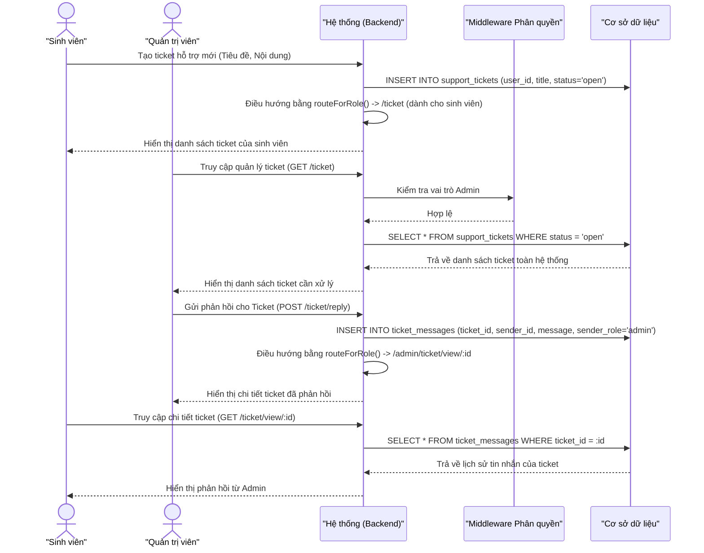

---

### 3.6. Hệ thống Thông báo đa kênh (Notification Engine)
*   **Thông báo chuông (Notification Bell)**:
    *   Tự động hiển thị các thông báo nghiệp vụ cá nhân hóa (như *"Yêu cầu mượn sách của bạn đã được duyệt"*, *"Ticket hỗ trợ của bạn có phản hồi mới"*).
    *   **Phân tách quyền**: Chuông thông báo của Sinh viên sẽ **lọc bỏ hoàn toàn** các thông báo hệ thống chỉ dành cho Admin (như thông báo có sinh viên gửi yêu cầu mượn sách mới hoặc có ticket hỗ trợ mới).
*   **Thông báo Email**: SMTP tự động gửi mail khi:
    *   Gửi mã OTP đăng ký / kích hoạt tài khoản.
    *   Gửi mã OTP khôi phục mật khẩu.
    *   Yêu cầu mượn sách được duyệt (bao gồm hạn trả chi tiết).
    *   Yêu cầu mượn sách bị từ chối.

### 3.7. Tư vấn sách & Kiểm duyệt nội dung bằng Trí tuệ nhân tạo (AI Assistant & Moderation)

#### 3.7.1. Trợ lý AI tư vấn sách (AI Book Consultation Chatbot)
*   **Chức năng:** Hỗ trợ Sinh viên trò chuyện, đặt câu hỏi để nhận các gợi ý sách hoặc tài liệu học tập phù hợp theo nhu cầu cá nhân.
*   **Tích hợp API:** Sử dụng mô hình `gemini-2.0-flash` thông qua Gemini API để xử lý ngôn ngữ tự nhiên và tạo câu trả lời tối ưu.
*   **Cơ chế Cache phản hồi (Caching Engine):**
    *   Hệ thống băm (hash SHA-256) nội dung câu hỏi (prompt) của độc giả thành một chuỗi duy nhất làm khóa (`prompt_hash`).
    *   Trước khi gọi API ngoài, hệ thống truy vấn bảng `ai_responses_cache` tìm kiếm `prompt_hash` tương ứng.
    *   Nếu tìm thấy bản ghi trùng khớp, trợ lý AI trả về kết quả lưu trữ ngay lập tức mà không cần gọi API ngoài. Việc này giúp giảm thiểu độ trễ phản hồi và tiết kiệm tối đa hạn ngạch (quota) gọi API.
    *   Nếu không tìm thấy, hệ thống gọi Gemini API, trả kết quả cho người dùng đồng thời ghi kết quả mới vào bảng `ai_responses_cache`.
*   **Cấu hình kết nối & Thời gian chờ (Timeout):** Để tránh việc API phản hồi chậm gây lỗi trên giao diện, thời gian chờ tối đa (HTTP client request timeout) khi gửi yêu cầu đến Gemini API được thiết lập là **15 giây**.
*   **Lịch sử hội thoại:** Mọi cuộc hội thoại giữa độc giả và chatbot AI đều được ghi lại chi tiết vào bảng `chat_logs` để hỗ trợ cải tiến chất lượng và phân tích xu hướng quan tâm của độc giả.

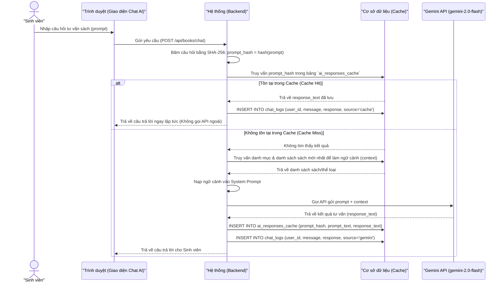

#### 3.7.2. Kiểm duyệt nội dung tự động bằng AI (AI Content Moderation)
*   **Chức năng:** Tự động lọc và ngăn chặn các nội dung không phù hợp (nhạy cảm, bạo lực, xúc phạm,...) được đăng tải trên Kênh thảo luận công khai (`public_chats`).
*   **Cơ chế hoạt động:**
    *   Khi người dùng gửi tin nhắn chat, hệ thống gửi nội dung đó qua cổng kiểm duyệt nội dung của Gemini AI trước khi lưu vào CSDL.
    *   Nếu Gemini AI đánh giá nội dung vi phạm tiêu chuẩn cộng đồng, hệ thống chặn gửi tin nhắn, hiển thị cảnh báo vi phạm cho người dùng và từ chối lưu vào bảng `public_chats`.
    *   **Cơ chế dự phòng (Fallback):** Trong trường hợp lỗi kết nối API (hoặc quá thời gian chờ 15 giây), hệ thống tự động chuyển sang chế độ đối khớp từ cấm (local blacklist) với danh sách các từ thô tục được định nghĩa cục bộ. Điều này đảm bảo tính năng trò chuyện không bị gián đoạn hoàn toàn khi API mất kết nối.

---

### 3.8. Bảng điều khiển & Thống kê (Dashboard & Analytics)

#### 3.8.1. Bảng điều khiển Sinh viên (Student Dashboard)
*   **Tổng hợp nhanh**: Hiển thị các chỉ số cá nhân gồm: Tổng sách đang mượn, Số sách quá hạn, Số sách sắp đến hạn trả, Tổng sách đã trả thành công.
*   **Biểu đồ mượn/trả theo tháng**: Biểu đồ cột (Bar Chart) vẽ bằng **Chart.js** thể hiện xu hướng mượn và trả sách của chính sinh viên trong năm, cho phép chọn năm thống kê.
*   **Biểu đồ phân bổ thể loại đã mượn**: Biểu đồ tròn (Donut Chart) thể hiện tỷ lệ các thể loại sách mà sinh viên đã mượn.
*   **Giao dịch gần đây**: Danh sách 6 phiếu mượn mới nhất hiển thị trực tiếp trên dashboard.
*   **Top 5 sách thịnh hành**: Hiển thị các cuốn sách được mượn nhiều nhất trong hệ thống.
*   **Cảnh báo khóa tài khoản**: Nếu tài khoản bị khóa, hiển thị banner cảnh báo kèm lý do và thời điểm khóa.

#### 3.8.2. Bảng điều khiển Quản trị viên (Admin Dashboard)
*   **Tổng hợp toàn hệ thống**: Hiển thị: Tổng đầu sách, Tổng bản sao, Tổng thể loại, Tổng thành viên, Đang mượn, Quá hạn, Sắp đến hạn, Đã trả.
*   **Biểu đồ xu hướng mượn theo thể loại và tháng**: Biểu đồ đường (Line Chart) phân tích xu hướng mượn sách gom nhóm theo thể loại qua từng tháng.
*   **Biểu đồ tình trạng kho sách (Inventory Status)**: Biểu đồ thanh ngang (Horizontal Bar Chart) thể hiện số lượng sách khả dụng, đang mượn, không khả dụng cho từng thể loại.
*   **Biểu đồ thể loại đang được mượn**: Biểu đồ donut thể hiện tỷ lệ phân bổ thể loại sách đang trong trạng thái mượn.
*   **Top 5 độc giả tích cực (Top Readers)**: Hiển thị bảng xếp hạng sinh viên mượn nhiều nhất theo khoảng thời gian (tháng).

#### 3.8.3. Xuất báo cáo thống kê Excel (.xlsx)
*   **Xuất thống kê mượn/trả**: Báo cáo mượn/trả theo tháng, hỗ trợ lọc theo Năm và Quý. File xuất chứa bảng dữ liệu tháng – lượt mượn – lượt trả, có hàng tổng cộng bằng công thức `=SUM()`.
*   **Xuất thống kê theo thể loại**: Báo cáo phân bổ số lượng sách (Admin) hoặc lượt mượn (Sinh viên) theo từng thể loại kèm tỷ lệ phần trăm.
*   **Xuất thống kê thể loại theo tháng (Admin)**: Báo cáo chi tiết lượt mượn từng thể loại qua 12 tháng, hoặc tổng hợp theo một tháng cụ thể.
*   **Định dạng chuyên nghiệp**: Tất cả file Excel được định dạng với tiêu đề màu sắc, zebra row styling, auto-filter, freeze pane, và auto-size column width.

---

### 3.9. Quản lý Hồ sơ Cá nhân (Profile Management)

*   **Xem hồ sơ**: Hiển thị thông tin cá nhân (họ tên, biệt danh, email, điện thoại, ngày sinh, ảnh đại diện) cùng thống kê cá nhân: Tổng sách đã mượn, đang mượn, quá hạn, số lượng đánh giá đã gửi.
*   **Cập nhật hồ sơ**: Sinh viên được phép cập nhật: biệt danh (`nickname`), số điện thoại, ngày sinh.
*   **Upload ảnh đại diện (Avatar)**:
    *   Hỗ trợ các định dạng: PNG, JPG, JPEG, WEBP, GIF.
    *   Giới hạn kích thước tối đa: **2 MB**.
    *   Hệ thống tự động xóa file ảnh đại diện cũ trên máy chủ khi cập nhật ảnh mới.
    *   Lưu đường dẫn vào trường `avatar_url` của bảng `users`.
*   **Lịch sử mượn/trả sách**: Danh sách phiếu mượn cá nhân với đầy đủ chức năng tìm kiếm, lọc theo trạng thái, sắp xếp, và phân trang.
*   **Admin Profile**: Admin có template riêng hiển thị thống kê toàn hệ thống (tổng danh mục, đầu sách, bản sao, thành viên, phiếu đang mượn).

---

### 3.10. Cấu hình & Quản trị hệ thống (System Configuration)

#### 3.10.1. Chế độ Bảo trì (Maintenance Mode)
*   **Bật/Tắt bảo trì**: Admin kích hoạt chế độ bảo trì qua trang Cài đặt hệ thống. Yêu cầu thiết lập thời gian kết thúc bảo trì (phải ở tương lai).
*   **Middleware tự động**: Hệ thống gắn Event Listener tại sự kiện `MvcEvent::EVENT_ROUTE` kiểm tra trạng thái bảo trì trước mỗi request. Nếu đang bảo trì, tất cả người dùng (trừ trang Auth và trang Maintenance) sẽ bị chuyển hướng sang trang thông báo bảo trì.
*   **Trang Bảo trì**: Hiển thị thông điệp bảo trì kèm countdown đến thời gian dự kiến mở lại hệ thống.
*   **Tự động tắt**: Khi thời gian `maintenance_until` đã qua, hệ thống tự động cho phép truy cập bình thường mà không cần Admin tắt thủ công.

#### 3.10.2. Quản lý Danh mục Thể loại sách (Category Management)
*   **Thêm thể loại mới**: Admin nhập tên thể loại (tối đa 100 ký tự). Hệ thống kiểm tra trùng lặp tên trước khi thêm.
*   **Sửa tên thể loại**: Đổi tên danh mục. Hệ thống tự động **cập nhật cascading** tên thể loại trong tất cả sách thuộc danh mục cũ sang tên mới.
*   **Xóa thể loại**: Chỉ cho phép xóa danh mục khi **không có cuốn sách nào** đang thuộc danh mục đó. Nếu còn sách, hệ thống báo lỗi kèm số lượng sách đang sử dụng.

#### 3.10.3. Upload Logo Thư viện
*   Admin tải lên logo thư viện (hỗ trợ PNG/JPG/JPEG/SVG/WEBP, tối đa 2MB).
*   Hệ thống tự động xóa file logo cũ trước khi lưu file mới. Logo được hiển thị trên giao diện hệ thống.

#### 3.10.4. Cấu hình SMTP & Google OAuth
*   Cấu hình máy chủ gửi thư (SMTP): Email gửi, mật khẩu ứng dụng. Mật khẩu chỉ cập nhật khi có nhập mới (tránh ghi đè rỗng).
*   Cấu hình Google OAuth2: Client ID, Client Secret, Redirect URI — lưu trong bảng `system_settings`.

#### 3.10.5. Quản trị Thành viên & Ràng buộc an toàn khi xóa (User Management & Deletion Constraints)
*   Admin có quyền xem danh sách thành viên, cập nhật thông tin và phê duyệt/khóa/mở khóa tài khoản.
*   **Các ràng buộc an toàn khi xóa tài khoản**:
    *   Chỉ được phép xóa tài khoản của sinh viên (`student`), không được xóa tài khoản quản trị viên (`admin`).
    *   Chặn không cho phép tự xóa tài khoản của chính mình (tài khoản đang đăng nhập).
    *   Chặn không cho phép xóa tài khoản sinh viên đang mượn sách hoặc đang có yêu cầu mượn sách ở trạng thái chờ duyệt (`pending`).

---

### 3.11. Giao diện lập trình ứng dụng REST API (RESTful API Layer)

Hệ thống cung cấp một lớp API RESTful cho phép tương tác dữ liệu bằng JSON, phục vụ các yêu cầu AJAX từ giao diện người dùng:

#### 3.11.1. Book API (`/api/books`)
*   `GET /api/books` — Lấy danh sách toàn bộ sách.
*   `GET /api/books/:id` — Lấy chi tiết một cuốn sách.
*   `POST /api/books` — Tạo sách mới (JSON body).
*   `PUT /api/books/:id` — Cập nhật thông tin sách.
*   `DELETE /api/books/:id` — Xóa sách.
*   `GET /api/books/search?q=...&available_only=1&limit=20` — Tìm kiếm sách autocomplete cho form mượn sách. Trả về danh sách sách phù hợp kèm label hiển thị.
*   `POST /api/books/chat` — Gửi tin nhắn tới chatbot AI tư vấn sách. Hệ thống tự động nạp dữ liệu thể loại và sách mới nhất vào system prompt để AI gợi ý chính xác.

#### 3.11.2. Notification API (`/api/notifications`)
*   `GET /api/notifications` — Lấy danh sách 15 thông báo gần nhất (phân quyền Admin/Student).
*   `POST /api/notifications` — Đánh dấu đã đọc (`mark read`) hoặc xóa (`delete`) thông báo.
*   **Quét tự động sách quá hạn**: Mỗi lần gọi API, hệ thống quét bảng `borrow_records` tìm sách quá hạn chưa cập nhật trạng thái, tự động chuyển sang `overdue` và tạo thông báo cảnh báo.
*   **Tự động tạo thông báo theo sự kiện**: API tự động phát hiện và tạo thông báo cho các sự kiện mới (phiếu mượn pending, ticket mới, phiếu duyệt, ticket phản hồi) nếu chưa có thông báo tương ứng.
*   **Dọn dẹp tự động**: Xóa thông báo đã đọc cũ hơn 30 ngày (chạy ngẫu nhiên 10% request để tiết kiệm hiệu suất).

#### 3.11.3. Borrow API & User API
*   `BorrowApiController`: API quản lý phiếu mượn sách.
*   `UserApiController`: API quản lý thông tin người dùng.

---

## 4. Yêu cầu giao diện bên ngoài (External Interface Requirements)

### 4.1. Giao diện người dùng (User Interface)
*   **Thiết kế tối (Dark Theme)**: Màu nền tối chủ đạo phối hợp cùng các mảng màu thương hiệu (tím, cam, xanh lá) mang lại cảm giác cao cấp.
*   **Kính mờ (Glassmorphism)**: Sử dụng các lớp nền trong suốt nhẹ, viền mảnh mảnh và bộ lọc làm mờ phông nền phía sau (`backdrop-filter: blur()`) cho các bảng Login, Đăng ký, Đặt lại mật khẩu.
*   **Custom Modals**: Các hộp thoại xác nhận gia hạn sách, đóng ticket hiển thị trực quan dạng pop-up có lớp phủ mờ bên dưới, tự động căn giữa màn hình và tối ưu trên thiết bị di động (Responsive Layout).

### 4.2. Giao diện phần mềm (Software Interface)
*   **Google Identity Platform**: Tương tác với Google API thông qua OAuth2 Client để nhận diện tài khoản Google.
*   **SMTP Mail Server**: Kết nối với cổng SMTP (ví dụ Gmail SMTP trên cổng 587 bằng TLS) thông qua PHPMailer để gửi thư điện tử.

---

## 5. Các yêu cầu phi chức năng (Non-Functional Requirements)

### 5.1. An toàn & Bảo mật (Security)
*   **Mã hóa mật khẩu**: Mật khẩu phải được băm bảo mật bằng thuật toán `password_hash($password, PASSWORD_DEFAULT)` trước khi lưu vào CSDL. Nghiêm cấm lưu trữ mật khẩu dưới dạng văn bản thuần túy (Plaintext).
*   **Ngăn chặn brute-force**: Khóa đăng nhập OTP sau 5 lần nhập sai và áp dụng đếm ngược 60 giây ở giao diện người dùng để ngăn chặn spam email.
*   **Bảo vệ dữ liệu**: Lọc kỹ dữ liệu đầu vào chống tấn công XSS, SQL Injection và phân tách đường dẫn quản trị rõ ràng.

### 5.2. Tính tin cậy và sẵn sàng (Reliability & Availability)
*   Cơ chế Transactions đảm bảo tính toàn vẹn dữ liệu cho các hoạt động mượn sách khả dụng (sách chỉ bị trừ khi ghi nhận thành công).
*   Hệ thống có thể khôi phục lại trạng thái bình thường sau các sự cố gián đoạn gửi mail bằng cách cho phép người dùng tự bấm "Gửi lại mã OTP" sau 60 giây.

---

## 6. Thiết kế Cơ sở dữ liệu (Database Schema)

Kiến trúc dữ liệu vật lý của hệ thống được mô hình hóa qua sơ đồ thực thể liên kết (ERD) dưới đây:

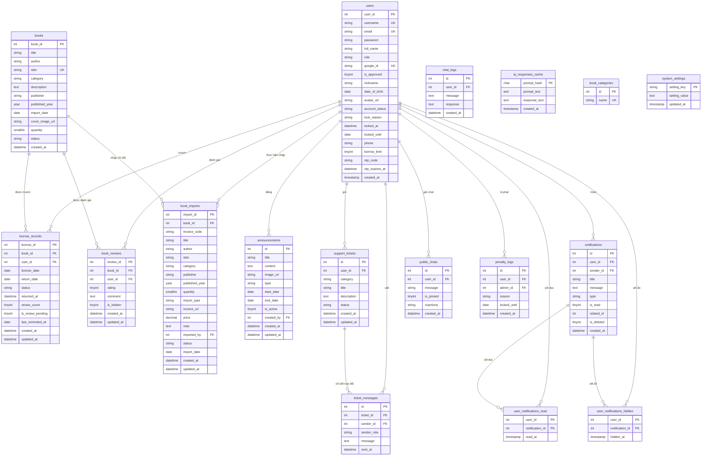

Chi tiết cấu trúc từng bảng CSDL được định nghĩa cụ thể:

### 6.1. Bảng `users` (Quản lý người dùng)
*   `user_id` (INT UNSIGNED, Primary Key, Auto Increment): ID định danh người dùng.
*   `username` (VARCHAR(50), Unique, Not Null): Tên đăng nhập.
*   `email` (VARCHAR(100), Unique, Not Null): Địa chỉ email.
*   `password` (VARCHAR(255), Not Null): Mật khẩu đã băm.
*   `full_name` (VARCHAR(100), Not Null): Họ và tên đầy đủ.
*   `role` (ENUM('admin', 'student'), Default 'student'): Vai trò trong hệ thống.
*   `google_id` (VARCHAR(100), Unique, Nullable): ID liên kết tài khoản Google OAuth.
*   `is_approved` (TINYINT(1), Default 0): Trạng thái phê duyệt tài khoản (0 = chờ OTP, 1 = đã duyệt).
*   `nickname` (VARCHAR(100), Nullable): Biệt danh người dùng.
*   `date_of_birth` (DATE, Nullable): Ngày sinh.
*   `avatar_url` (VARCHAR(255), Nullable): Đường dẫn ảnh đại diện.
*   `account_status` (ENUM('active', 'locked'), Default 'active'): Trạng thái tài khoản (bị khóa phạt hoặc đang hoạt động).
*   `lock_reason` (VARCHAR(255), Nullable): Lý do khóa tài khoản.
*   `locked_at` (DATETIME, Nullable): Thời điểm khóa tài khoản.
*   `locked_until` (DATE, Nullable): Thời hạn mở khóa phạt (NULL = khóa vĩnh viễn).
*   `phone` (VARCHAR(20), Nullable): Số điện thoại liên hệ.
*   `borrow_limit` (TINYINT UNSIGNED, Default 5): Hạn mức mượn tối đa của sinh viên.
*   `otp_code` (VARCHAR(10), Nullable): Mã OTP xác thực hiện tại.
*   `otp_expires_at` (DATETIME, Nullable): Thời gian hết hạn của OTP.
*   `created_at` (TIMESTAMP, Default CURRENT_TIMESTAMP): Thời điểm đăng ký tài khoản.

### 6.2. Bảng `books` (Danh mục sách)
*   `book_id` (INT UNSIGNED, Primary Key, Auto Increment): ID định danh sách.
*   `title` (VARCHAR(255), Not Null): Tiêu đề sách.
*   `author` (VARCHAR(150), Not Null): Tác giả cuốn sách.
*   `isbn` (VARCHAR(30), Nullable): Mã số tiêu chuẩn quốc tế cho sách.
*   `category` (VARCHAR(100), Default 'Khác'): Thể loại sách.
*   `description` (TEXT, Nullable): Mô tả ngắn nội dung sách.
*   `publisher` (VARCHAR(255), Nullable): Nhà xuất bản.
*   `published_year` (YEAR, Nullable): Năm xuất bản.
*   `import_date` (DATE, Nullable): Ngày nhập kho.
*   `cover_image_url` (VARCHAR(255), Nullable): Đường dẫn ảnh bìa sách.
*   `quantity` (SMALLINT UNSIGNED, Default 1): Số lượng sách hiện khả dụng trên kệ để mượn (được tăng/giảm trực tiếp khi mượn/trả/hủy phiếu).
*   `status` (ENUM('available', 'borrowed', 'unavailable', 'lost'), Default 'available'): Trạng thái hoạt động của sách.
*   `created_at` (DATETIME, Default CURRENT_TIMESTAMP): Thời điểm tạo sách trên hệ thống.

### 6.3. Bảng `borrow_records` (Giao dịch mượn/trả sách)
*   `borrow_id` (INT UNSIGNED, Primary Key, Auto Increment): ID định danh bản ghi mượn.
*   `book_id` (INT UNSIGNED, Foreign Key): Sách được mượn.
*   `user_id` (INT UNSIGNED, Foreign Key): Sinh viên mượn sách.
*   `borrow_date` (DATE, Not Null): Ngày nhận sách.
*   `return_date` (DATE, Nullable): Hạn phải trả sách.
*   `status` (ENUM('pending', 'borrowed', 'returned', 'overdue', 'lost'), Default 'pending'): Trạng thái phiếu mượn.
*   `returned_at` (DATETIME, Nullable): Ngày trả sách thực tế.
*   `renew_count` (TINYINT(1), Default 0): Số lần đã gia hạn cuốn sách này.
*   `is_renew_pending` (TINYINT(1), Default 0): Trạng thái đang chờ duyệt gia hạn.
*   `last_reminded_at` (DATE, Nullable): Ngày gửi thông báo nhắc nhở quá hạn gần nhất.
*   `created_at` (DATETIME, Default CURRENT_TIMESTAMP): Thời điểm tạo phiếu.
*   `updated_at` (DATETIME, Default CURRENT_TIMESTAMP): Thời điểm cập nhật phiếu.

### 6.4. Bảng `book_reviews` (Đánh giá & Bình luận sách)
*   `review_id` (INT UNSIGNED, Primary Key, Auto Increment): ID đánh giá.
*   `book_id` (INT UNSIGNED, Foreign Key): Sách được đánh giá.
*   `user_id` (INT UNSIGNED, Foreign Key): Sinh viên thực hiện đánh giá.
*   `rating` (TINYINT UNSIGNED, Default 5): Điểm đánh giá (1-5 sao).
*   `comment` (TEXT, Nullable): Nội dung bình luận.
*   `is_hidden` (TINYINT(1), Default 0): Trạng thái ẩn bình luận (khi vi phạm chính sách).
*   `created_at` (DATETIME, Default CURRENT_TIMESTAMP): Ngày tạo.
*   `updated_at` (DATETIME, Default CURRENT_TIMESTAMP): Ngày cập nhật.

### 6.5. Bảng `book_imports` (Nhập kho sách)
*   `import_id` (INT UNSIGNED, Primary Key, Auto Increment): ID hóa đơn nhập.
*   `book_id` (INT UNSIGNED, Nullable, Foreign Key): Liên kết đến sách sau khi đồng bộ.
*   `invoice_code` (VARCHAR(50), Not Null): Mã hóa đơn nhập.
*   `title` (VARCHAR(255), Not Null): Tên sách nhập.
*   `author` (VARCHAR(150), Default 'Khác'): Tác giả.
*   `isbn` (VARCHAR(30), Nullable): Mã ISBN.
*   `category` (VARCHAR(100), Default 'Khác'): Danh mục thể loại.
*   `publisher` (VARCHAR(255), Nullable): Nhà xuất bản.
*   `published_year` (YEAR, Nullable): Năm xuất bản.
*   `quantity` (SMALLINT UNSIGNED, Default 1): Số lượng nhập.
*   `import_type` (ENUM('purchase', 'donation', 'other'), Default 'purchase'): Kiểu nhập (mua/tặng/khác).
*   `invoice_url` (VARCHAR(500), Nullable): Đường dẫn tài liệu hóa đơn.
*   `price` (DECIMAL(12,2), Default 0.00): Giá trị sách nhập.
*   `note` (TEXT, Nullable): Ghi chú.
*   `imported_by` (INT UNSIGNED, Foreign Key): Admin thực hiện nhập.
*   `status` (ENUM('pending', 'approved', 'rejected'), Default 'approved'): Trạng thái duyệt hóa đơn.
*   `import_date` (DATE, Nullable): Ngày nhập.
*   `created_at` (DATETIME, Default CURRENT_TIMESTAMP): Ngày tạo bản ghi.

### 6.6. Bảng `announcements` (Bảng tin thông báo)
*   `id` (INT UNSIGNED, Primary Key, Auto Increment): ID thông báo.
*   `title` (VARCHAR(255), Not Null): Tiêu đề thông báo bảng tin.
*   `content` (TEXT, Not Null): Nội dung thông báo.
*   `image_url` (VARCHAR(255), Nullable): Hình ảnh kèm theo.
*   `type` (ENUM('event', 'contest', 'holiday', 'general'), Default 'general'): Phân loại thông báo.
*   `start_date` (DATE, Nullable): Ngày bắt đầu hiển thị.
*   `end_date` (DATE, Nullable): Ngày kết thúc hiển thị.
*   `is_active` (TINYINT(1), Default 1): Trạng thái hiển thị hoạt động.
*   `created_by` (INT UNSIGNED, Foreign Key): Admin đăng thông báo.
*   `created_at` (DATETIME, Default CURRENT_TIMESTAMP): Ngày tạo.
*   `updated_at` (DATETIME, Default CURRENT_TIMESTAMP): Ngày cập nhật.

### 6.7. Bảng `support_tickets` (Yêu cầu hỗ trợ)
*   `id` (INT UNSIGNED, Primary Key, Auto Increment): ID ticket hỗ trợ.
*   `user_id` (INT UNSIGNED, Foreign Key): Sinh viên gửi yêu cầu.
*   `category` (ENUM('lost_item', 'damaged_book', 'card_issue', 'other'), Default 'other'): Danh mục sự cố hỗ trợ.
*   `title` (VARCHAR(255), Not Null): Tiêu đề yêu cầu hỗ trợ.
*   `description` (TEXT, Not Null): Chi tiết yêu cầu sự cố.
*   `status` (ENUM('open', 'in_progress', 'closed'), Default 'open'): Trạng thái xử lý ticket.
*   `created_at` (DATETIME, Default CURRENT_TIMESTAMP): Ngày mở ticket.
*   `updated_at` (DATETIME, Default CURRENT_TIMESTAMP): Ngày cập nhật cuối.

### 6.8. Bảng `ticket_messages` (Chi tiết tin nhắn hỗ trợ)
*   `id` (INT UNSIGNED, Primary Key, Auto Increment): ID tin nhắn hỗ trợ.
*   `ticket_id` (INT UNSIGNED, Foreign Key): Ticket liên quan.
*   `sender_id` (INT UNSIGNED, Foreign Key): Người gửi tin nhắn.
*   `sender_role` (ENUM('user', 'admin'), Not Null): Vai trò người gửi phản hồi.
*   `message` (TEXT, Not Null): Nội dung tin nhắn trao đổi.
*   `sent_at` (DATETIME, Default CURRENT_TIMESTAMP): Thời điểm gửi tin.

### 6.9. Bảng `chat_logs` (Lịch sử hội thoại chatbot)
*   `id` (INT UNSIGNED, Primary Key, Auto Increment): ID log hội thoại.
*   `user_id` (INT UNSIGNED, Nullable, Foreign Key): Sinh viên trao đổi (NULL nếu khách vãng lai).
*   `message` (TEXT, Not Null): Tin nhắn gửi của người dùng.
*   `response` (TEXT, Not Null): Phản hồi từ chatbot AI.
*   `created_at` (DATETIME, Default CURRENT_TIMESTAMP): Thời điểm trò chuyện.

### 6.10. Bảng `notifications` (Thông báo hệ thống)
*   `id` (INT UNSIGNED, Primary Key, Auto Increment): ID thông báo.
*   `user_id` (INT UNSIGNED, Nullable, Foreign Key): Độc giả nhận thông báo (NULL nếu là thông báo hệ thống gửi Admin).
*   `sender_id` (INT UNSIGNED, Nullable, Foreign Key): Người gửi tạo thông báo.
*   `title` (VARCHAR(255), Not Null): Tiêu đề thông báo.
*   `message` (TEXT, Not Null): Nội dung chi tiết thông báo.
*   `type` (ENUM('system', 'ticket', 'borrow_alert', 'general', 'ticket_answered', 'borrow', 'borrow_approved'), Default 'system'): Phân loại thông báo để định tuyến.
*   `is_read` (TINYINT(1), Default 0): Trạng thái đã đọc (1 = đã đọc, 0 = chưa đọc).
*   `related_id` (INT UNSIGNED, Nullable): ID thực thể liên quan (ví dụ: `borrow_id` hoặc `ticket_id`).
*   `is_deleted` (TINYINT(1), Default 0): Trạng thái xóa mềm thông báo.
*   `created_at` (DATETIME, Default CURRENT_TIMESTAMP): Ngày tạo thông báo.

### 6.11. Bảng `user_notifications_read` (Vết đọc thông báo chung)
*   `user_id` (INT UNSIGNED, Primary Key, Foreign Key): Sinh viên đã đọc thông báo.
*   `notification_id` (INT UNSIGNED, Primary Key, Foreign Key): ID thông báo chung đã đọc.
*   `read_at` (TIMESTAMP, Default CURRENT_TIMESTAMP): Thời điểm đọc thông báo.

### 6.12. Bảng `user_notifications_hidden` (Vết ẩn thông báo chung)
*   `user_id` (INT UNSIGNED, Primary Key, Foreign Key): Sinh viên ẩn thông báo.
*   `notification_id` (INT UNSIGNED, Primary Key, Foreign Key): ID thông báo chung đã ẩn.
*   `hidden_at` (TIMESTAMP, Default CURRENT_TIMESTAMP): Thời điểm ẩn thông báo.

### 6.13. Bảng `ai_responses_cache` (Bộ nhớ đệm phản hồi AI)
*   `prompt_hash` (CHAR(64), Primary Key): Mã hash SHA-256 nội dung câu hỏi (prompt).
*   `prompt_text` (TEXT, Not Null): Văn bản câu hỏi gửi đi.
*   `response_text` (TEXT, Not Null): Phản hồi được cache để tiết kiệm tài nguyên gọi API.
*   `created_at` (TIMESTAMP, Default CURRENT_TIMESTAMP): Ngày tạo bản ghi.

### 6.14. Bảng `public_chats` (Kênh thảo luận công khai)
*   `id` (INT UNSIGNED, Primary Key, Auto Increment): ID tin nhắn chat công cộng.
*   `user_id` (INT UNSIGNED, Foreign Key): Sinh viên/Admin gửi tin nhắn.
*   `message` (VARCHAR(1000), Not Null): Nội dung tin nhắn chat.
*   `is_pinned` (TINYINT(1), Default 0): Trạng thái ghim tin nhắn.
*   `reactions` (VARCHAR(1000), Nullable): Chuỗi JSON lưu vết các loại cảm xúc và thông tin user thả.
*   `created_at` (DATETIME, Default CURRENT_TIMESTAMP): Thời điểm gửi chat.

### 6.15. Bảng `book_categories` (Danh mục thể loại sách)
*   `id` (INT UNSIGNED, Primary Key, Auto Increment): ID danh mục.
*   `name` (VARCHAR(100), Unique, Not Null): Tên thể loại sách.

### 6.16. Bảng `system_settings` (Cài đặt hệ thống)
*   `setting_key` (VARCHAR(50), Primary Key): Tên khóa cấu hình (ví dụ: `smtp_host`, `google_client_id`, `maintenance_mode`).
*   `setting_value` (TEXT, Nullable): Giá trị cấu hình tương ứng.
*   `updated_at` (TIMESTAMP, Default CURRENT_TIMESTAMP ON UPDATE CURRENT_TIMESTAMP): Thời điểm cập nhật cuối cùng.

### 6.17. Bảng `penalty_logs` (Nhật ký phạt thành viên)
*   `id` (INT UNSIGNED, Primary Key, Auto Increment): ID bản ghi phạt.
*   `user_id` (INT UNSIGNED, Foreign Key): Thành viên bị xử phạt.
*   `admin_id` (INT UNSIGNED, Nullable, Foreign Key): Admin thực hiện xử phạt (NULL nếu là hệ thống tự động khóa).
*   `reason` (VARCHAR(500), Not Null): Lý do khóa phạt.
*   `locked_until` (DATE, Nullable): Hạn mở khóa phạt (NULL nếu khóa vĩnh viễn).
*   `created_at` (DATETIME, Default CURRENT_TIMESTAMP): Thời điểm ghi nhận xử phạt.

---

---

## 7. Các biểu đồ hệ thống (System Diagrams)

Hệ thống Thư viện HDPE hoạt động dựa trên các quy trình nghiệp vụ được mô hình hóa qua các biểu đồ sau đây sử dụng ngôn ngữ đặc tả Mermaid.js.

### 7.1. Biểu đồ Use Case (Use Case Diagram)

Sơ đồ Use Case thể hiện các chức năng chính phân chia theo quyền hạn của từng nhóm người dùng: Khách (Guest), Sinh viên (Student), và Quản trị viên (Admin).

```mermaid
graph TB
    subgraph "Hệ thống Thư viện HDPE"
        uc1("Đăng nhập / Đăng ký / Quên mật khẩu")
        uc2("Xem danh mục sách công cộng")
        uc3("Xem bảng tin & Thả cảm xúc")
        uc4("Đăng ký mượn sách & giữ chỗ")
        uc5("Gia hạn thời hạn mượn sách")
        uc6("Tạo & phản hồi Ticket hỗ trợ")
        uc7("Đánh giá sách (Rating & Bình luận)")
        uc8("Xem Dashboard & Thống kê cá nhân")
        uc9("Quản lý Hồ sơ & Avatar")
        uc10("Chat tư vấn sách AI")
        uc11("Quản lý sách & Nhập dữ liệu Excel")
        uc12("Phê duyệt / Từ chối phiếu mượn & gia hạn")
        uc13("Quản lý thành viên & Phạt khóa")
        uc14("Quản lý Bảng tin CRUD")
        uc15("Quản lý Danh mục thể loại sách")
        uc16("Cấu hình hệ thống & Bảo trì")
        uc17("Dashboard & Thống kê toàn hệ thống")
        uc18("Xuất báo cáo Excel")
    end

    Guest((Khách))
    Student((Sinh viên))
    Admin((Quản trị viên))

    Guest --> uc1
    Guest --> uc2
    Guest --> uc3

    Student --> uc1
    Student --> uc2
    Student --> uc3
    Student --> uc4
    Student --> uc5
    Student --> uc6
    Student --> uc7
    Student --> uc8
    Student --> uc9
    Student --> uc10

    Admin --> uc1
    Admin --> uc2
    Admin --> uc3
    Admin --> uc11
    Admin --> uc12
    Admin --> uc13
    Admin --> uc14
    Admin --> uc15
    Admin --> uc16
    Admin --> uc17
    Admin --> uc18
```

### 7.2. Biểu đồ Phân rã Chức năng (Functional Decomposition Diagram)

Sơ đồ phân rã chức năng mô tả cấu trúc phân cấp mô-đun của hệ thống thư viện thành các khối chức năng cụ thể:

```mermaid
graph TD
    Root["Hệ thống Thư viện HDPE"]
    
    Root --> M1["1. Xác thực & Tài khoản"]
    M1 --> M11["Đăng ký & OTP Kích hoạt"]
    M1 --> M12["Đăng nhập - Thường & Google"]
    M1 --> M13["Quên mật khẩu & Khóa Brute-force"]
    M1 --> M14["Quản lý Hồ sơ & Upload Avatar"]

    Root --> M2["2. Quản lý Sách"]
    M2 --> M21["Nhập sách - Thủ công & Excel"]
    M2 --> M22["Quản lý Danh mục thể loại"]
    M2 --> M23["Hóa đơn nhập & Xuất Excel"]
    M2 --> M24["Đánh giá & Bình luận sách"]

    Root --> M3["3. Nghiệp vụ Lưu thông"]
    M3 --> M31["Đăng ký mượn & Giữ chỗ"]
    M3 --> M32["Phê duyệt / Từ chối phiếu mượn"]
    M3 --> M33["Trả sách"]
    M3 --> M34["Yêu cầu & Phê duyệt Gia hạn"]
    M3 --> M35["Xử phạt tài khoản quá hạn"]

    Root --> M4["4. Tương tác & Thông báo"]
    M4 --> M41["Bảng tin CRUD & Bảng xếp hạng"]
    M4 --> M42["Chat công cộng - Ghim & Reactions"]
    M4 --> M43["Gửi & Phản hồi Ticket Hỗ trợ"]
    M4 --> M44["Thông báo chuông - Lọc quyền"]
    M4 --> M45["Thông báo Email - SMTP"]

    Root --> M5["5. Dashboard & Thống kê"]
    M5 --> M51["Dashboard Sinh viên"]
    M5 --> M52["Dashboard Admin"]
    M5 --> M53["Biểu đồ Chart.js"]
    M5 --> M54["Xuất báo cáo Excel"]

    Root --> M6["6. Trí tuệ nhân tạo"]
    M6 --> M61["Chatbot tư vấn sách - Gemini"]
    M6 --> M62["Kiểm duyệt nội dung chat"]
    M6 --> M63["Cache phản hồi AI"]

    Root --> M7["7. Cấu hình hệ thống"]
    M7 --> M71["Cấu hình SMTP"]
    M7 --> M72["Cấu hình Google OAuth"]
    M7 --> M73["Upload Logo thư viện"]
    M7 --> M74["Chế độ Bảo trì"]

    Root --> M8["8. REST API"]
    M8 --> M81["Book API - CRUD & Search"]
    M8 --> M82["Notification API"]
    M8 --> M83["Borrow API"]
    M8 --> M84["User API"]
```

### 7.3. Biểu đồ Hoạt động: Xác thực OTP & Đổi mật khẩu (Activity Diagram)

Sơ đồ hoạt động chi tiết hóa logic kiểm tra mã OTP khôi phục mật khẩu cùng cơ chế khóa Brute-force bảo mật:

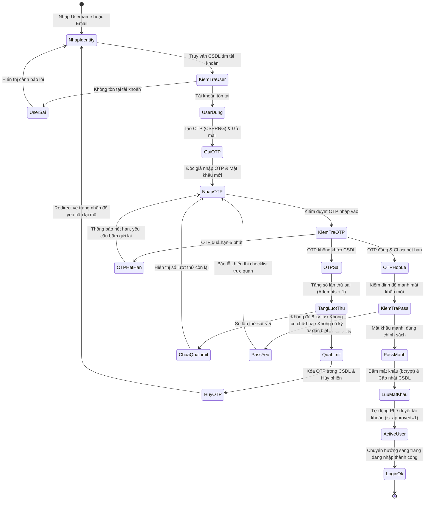

### 7.4. Biểu đồ Tuần tự: Khôi phục mật khẩu (Sequence Diagram)

Sơ đồ trình tự mô tả các tương tác qua lại giữa Độc giả, Trình duyệt, Hệ thống Thư viện (Laminas Controller), CSDL và Mail Server:

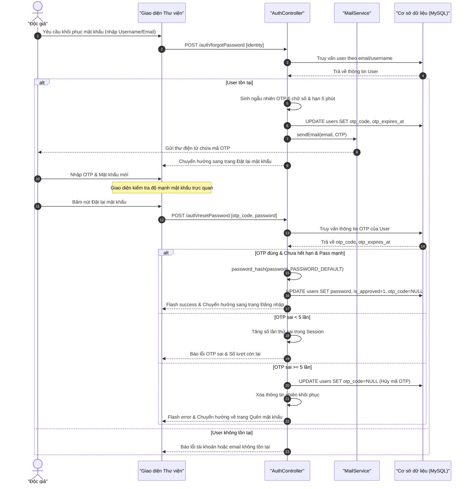

### 7.5. Biểu đồ Lớp (Class Diagram)

Sơ đồ lớp mô tả cấu trúc phân lớp đối tượng MVC của hệ thống quản lý thư viện, thể hiện mối quan hệ giữa Controller, Service, Table Gateway và Entity:

```mermaid
classDiagram
    class BaseController {
        #authSessionContainer
        #currentUser()
        #routeForRole(suffix)
        #requireLogin()
        #requireAdmin()
        #isAdmin()
    }
    
    class AuthController {
        -userTable
        -mailService
        +loginAction()
        +registerAction()
        +logoutAction()
        +verifyOtpAction()
        +forgotPasswordAction()
        +resetPasswordAction()
        +googleLoginAction()
    }

    class BookController {
        -bookTable
        -bookReviewTable
        +indexAction()
        +viewAction()
        +addAction()
        +editAction()
        +deleteAction()
        +reviewAction()
        +deleteReviewAction()
        +categoriesAction()
    }

    class BookImportController {
        -bookTable
        -dbAdapter
        +indexAction()
        +addAction()
        +importExcelAction()
        +downloadTemplateAction()
        +exportAction()
    }

    class TransactionController {
        -circulationService
        -borrowTable
        -bookReviewTable
        +indexAction()
        +borrowAction()
        +returnAction()
        +approveAction()
        +rejectAction()
        +renewAction()
        +approveRenewAction()
        +rejectRenewAction()
    }

    class UserController {
        -userTable
        -borrowTable
        +indexAction()
        +editAction()
        +lockAction()
        +unlockAction()
    }

    class TicketController {
        -ticketTable
        -ticketMessageTable
        +indexAction()
        +createAction()
        +viewAction()
        +replyAction()
        +closeAction()
    }

    class DashboardController {
        -bookTable
        -borrowTable
        -userTable
        -publicChatTable
        -geminiService
        +indexAction()
        +chatAction()
        +statsAction()
        +categoryStatsAction()
        +exportStatsAction()
        +exportCategoryStatsAction()
        +exportCategoryMonthlyStatsAction()
    }

    class AnnouncementController {
        -announcementTable
        -borrowTable
        +announcementsAction()
        +addAnnouncementAction()
        +editAnnouncementAction()
        +deleteAnnouncementAction()
    }

    class ProfileController {
        -userTable
        -borrowTable
        -bookTable
        -bookReviewTable
        +indexAction()
        +updateAction()
    }

    class SettingsController {
        -systemSettingsTable
        -bookCategoryTable
        -bookTable
        +indexAction()
        +logoAction()
        +maintenanceAction()
        +googleAction()
        +smtpAction()
        +addCategoryAction()
        +editCategoryAction()
        +deleteCategoryAction()
    }

    class HomeController {
        -systemSettingsTable
        +indexAction()
        +maintenanceAction()
    }

    class BookApiController {
        -bookTable
        -chatLogTable
        -geminiService
        +getList()
        +get(id)
        +create(data)
        +update(id, data)
        +delete(id)
        +searchAction()
        +chatAction()
    }

    class NotificationApiController {
        -notificationTable
        +indexAction()
    }
    
    class CirculationService {
        -adapter
        -bookTable
        -borrowTable
        -userTable
        -mailService
        +borrowBook(bookId, userId, borrowDate, returnDate, isApproved)
        +approveBorrow(recordId, borrowDate, returnDate)
        +rejectBorrow(recordId)
        +returnBook(recordId)
        +renewBook(recordId, userId, isDirect)
        +approveRenew(recordId)
        +rejectRenew(recordId)
    }

    class GeminiService {
        -apiKey
        -adapter
        +generateResponse(message, systemPrompt)
        +checkContent(message)
    }

    class MailService {
        -transport
        +sendEmail(to, toName, subject, body)
    }
    
    class UserTable {
        -tableGateway
        +getByUsername(username)
        +getByEmail(email)
        +getUser(id)
        +saveUser(user, passwordHash)
        +lockUser(id, reason, until, adminId)
        +unlockUser(id)
        +countByRole(role)
    }
    
    class BookTable {
        -tableGateway
        +getBook(id)
        +saveBook(book)
        +deleteBook(id)
        +fetchAll()
        +searchAvailable(query, availableOnly, limit)
        +decrementAvailability(id)
        +incrementAvailability(id)
        +getSummary()
        +getCategoryStats(userId)
        +getInventoryStatus()
        +getTrendingBooks(limit)
        +countCategories()
        +countBooksInCategory(name)
        +updateCategoryName(oldName, newName)
    }
    
    class BorrowTable {
        -tableGateway
        +requestBorrow(bookId, userId, borrowDate, returnDate)
        +hasOverdueLoans(userId)
        +countActiveLoansForUser(userId)
        +approve(recordId, borrowDate, returnDate)
        +reject(recordId)
        +getMonthlyStats(year, userId)
        +getCategoryMonthlyStats(year)
        +getTopReaders(limit, period)
        +fetchAllWithDetails(filters, userId, limit, offset)
    }

    class AnnouncementTable {
        -tableGateway
        +insertAnnouncement(data)
        +fetchAnnouncements(filters, page, perPage, sort, direction)
        +countFiltered(filters)
        +getGlobalCounts()
        +getTypeCounts(filters)
    }

    class BookReviewTable {
        -tableGateway
        +addReview(bookId, userId, rating, comment)
        +hasReviewed(userId, bookId)
        +hasBorrowedAny(userId, bookId)
        +deleteReview(reviewId)
        +countReviewsByUser(userId)
        +getReviewedBookIds(userId)
    }

    class NotificationTable {
        -tableGateway
        +insertNotification(userId, senderId, title, message, type, relatedId)
        +fetchRecentNotifications(userId, limit)
        +markAsRead(id, userId)
        +markAllAsRead(userId)
        +deleteNotification(id, userId)
        +cleanupOldNotifications(days)
    }

    class BookCategoryTable {
        -tableGateway
        +getByName(name)
        +getById(id)
        +insertCategory(name)
        +updateCategory(id, newName)
        +deleteCategory(id)
    }

    class SystemSettingsTable {
        -tableGateway
        +getSetting(key, default)
        +saveSetting(key, value)
    }

    class PublicChatTable {
        -tableGateway
        +insertMessage(userId, message)
        +fetchRecentMessages(limit)
        +fetchMessagesBefore(beforeId, limit)
        +deleteMessage(id)
        +pinMessage(id)
        +unpinAll()
        +getReactions(id)
        +updateReactions(id, reactions)
    }

    class User {
        +int id
        +string username
        +string email
        +string password
        +string role
        +bool isApproved
        +string accountStatus
        +string avatarUrl
        +isLocked()
        +exchangeArray(data)
    }

    class Book {
        +int id
        +string title
        +string author
        +string isbn
        +int quantity
        +string status
        +exchangeArray(data)
        +getArrayCopy()
    }

    class BorrowRecord {
        +int id
        +int bookId
        +int userId
        +string borrowDate
        +string returnDate
        +string status
        +int renewCount
        +bool isRenewPending
        +exchangeArray(data)
    }

    BaseController <|-- AuthController
    BaseController <|-- BookController
    BaseController <|-- BookImportController
    BaseController <|-- TransactionController
    BaseController <|-- UserController
    BaseController <|-- TicketController
    BaseController <|-- DashboardController
    BaseController <|-- AnnouncementController
    BaseController <|-- ProfileController
    BaseController <|-- SettingsController
    BaseController <|-- HomeController

    AuthController --> UserTable
    AuthController --> MailService

    BookController --> BookTable
    BookController --> BookReviewTable

    BookImportController --> BookTable

    TransactionController --> CirculationService
    TransactionController --> BorrowTable
    TransactionController --> BookReviewTable

    UserController --> UserTable
    UserController --> BorrowTable

    TicketController --> UserTable

    DashboardController --> BookTable
    DashboardController --> BorrowTable
    DashboardController --> UserTable
    DashboardController --> PublicChatTable
    DashboardController --> GeminiService

    AnnouncementController --> AnnouncementTable
    AnnouncementController --> BorrowTable

    ProfileController --> UserTable
    ProfileController --> BorrowTable
    ProfileController --> BookTable
    ProfileController --> BookReviewTable

    SettingsController --> SystemSettingsTable
    SettingsController --> BookCategoryTable
    SettingsController --> BookTable

    HomeController --> SystemSettingsTable

    BookApiController --> BookTable
    BookApiController --> GeminiService

    NotificationApiController --> NotificationTable

    CirculationService --> UserTable
    CirculationService --> BookTable
    CirculationService --> BorrowTable
    CirculationService --> MailService

    UserTable --> User
    BookTable --> Book
    BorrowTable --> BorrowRecord
```

### 7.6. Biểu đồ Trạng thái: Vòng đời Phiếu mượn sách (Circulation Lifecycle Diagram)

Sơ đồ trạng thái dưới đây mô tả chi tiết vòng đời của một yêu cầu mượn sách từ khi tạo lập cho đến khi trả sách hoặc quá hạn bị xử phạt:

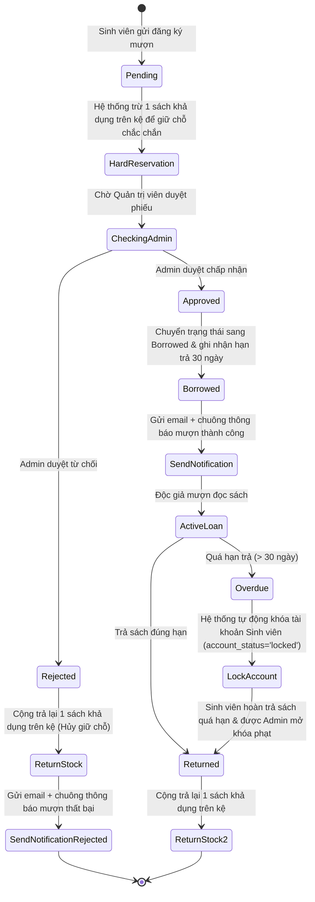

## 8. Kết quả Kiểm thử & Xác minh Hệ thống (System Verification & QA Testing Results)

Để đảm bảo hệ thống đáp ứng đầy đủ các yêu cầu đặc tả (chức năng và phi chức năng) trong tài liệu SRS này, một đợt kiểm thử toàn diện (Full-stack QA Testing) đã được thực hiện vào ngày 05/06/2026.

### 8.1. Tóm tắt kết quả kiểm thử toàn hệ thống
* **Tổng số ca kiểm thử:** 140 ca
* **Trạng thái:**
  - **Đạt (PASS):** 140 / 140 ca (Tỉ lệ 100%)
  - **Lỗi (FAIL):** 0 ca
  - **Bỏ qua (SKIP):** 0 ca

### 8.2. Chi tiết kết quả kiểm thử theo phương pháp

#### 8.2.1. Kiểm thử đơn vị & Tích hợp (PHPUnit Tests)
Kiểm thử tự động ở cấp độ mã nguồn thông qua PHPUnit, kiểm tra các Model, Service, Form, và Controller Factories:
* **Số lượng:** 107/107 Unit Tests
* **Trạng thái:** ✅ PASS
* **Phạm vi phủ sóng:** Xác thực người dùng, Ràng buộc nhập kho (ISBN), Động cơ mượn/trả sách (Circulation Service, Penalty Logic, Overdue limits), Bảng tin, Ticket hỗ trợ, Cấu hình hệ thống, và API Controllers.

#### 8.2.2. Kiểm thử luồng E2E & Giao diện (Browser E2E Tests)
Kiểm thử giả lập người dùng trên trình duyệt Chrome để đảm bảo hoạt động trơn tru của các tính năng Frontend tương tác với Backend:
* **Số lượng:** 33/33 kịch bản tích hợp nâng cao
* **Trạng thái:** ✅ PASS
* **Các kịch bản E2E cốt lõi:**
  1. **Đăng ký sinh viên mới:** Nhập thông tin -> gửi OTP qua Email -> xác thực OTP thành công -> tài khoản chuyển sang trạng thái kích hoạt (`is_approved = 1`).
  2. **Luồng Khôi phục Mật khẩu:** Gửi yêu cầu -> nhận OTP -> đổi mật khẩu mới (tích hợp độ mạnh mật khẩu trực quan) -> đăng nhập bằng mật khẩu mới thành công.
  3. **Khóa chống Brute-force OTP:** Nhập sai OTP quá 5 lần sẽ tự động hủy phiên khôi phục để bảo mật.
  4. **Nhập kho tự động:** Import file Excel chứa ISBN, cộng dồn số lượng bản sao khả dụng và tự động cập nhật trạng thái sách.
  5. **Giữ chỗ chắc chắn (Hard Reservation):** Sinh viên gửi yêu cầu mượn `pending` -> số lượng sách khả dụng giảm ngay lập tức. Admin từ chối -> hoàn trả số lượng về kệ.
  6. **Kiểm duyệt tin nhắn bằng AI:** Gửi tin nhắn chứa từ cấm sẽ bị chặn qua API (mã lỗi 400), tự động fallback sang danh sách từ cấm cục bộ (local blacklist) khi mất kết nối.
  7. **Hỏi đáp & hỗ trợ (Support Ticket):** Tạo ticket -> admin phản hồi -> sinh viên phản hồi, định tuyến an toàn không lỗi phân quyền.
  8. **Cấu hình & Xóa tài khoản:** Chặn xóa admin, chặn tự xóa chính mình, chặn xóa sinh viên đang có sách mượn hoặc yêu cầu chờ duyệt.

Chi tiết nhật ký chạy kiểm thử và kịch bản chi tiết được ghi nhận tại tài liệu [QA_REPORT.md](file:///c:/xampp/htdocs/laminas-app/QA_REPORT.md).

