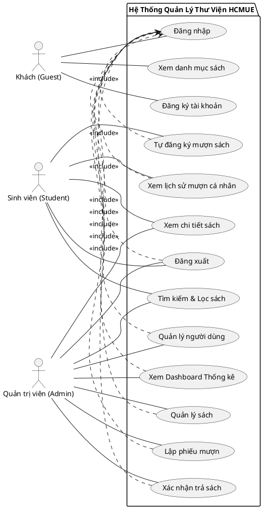
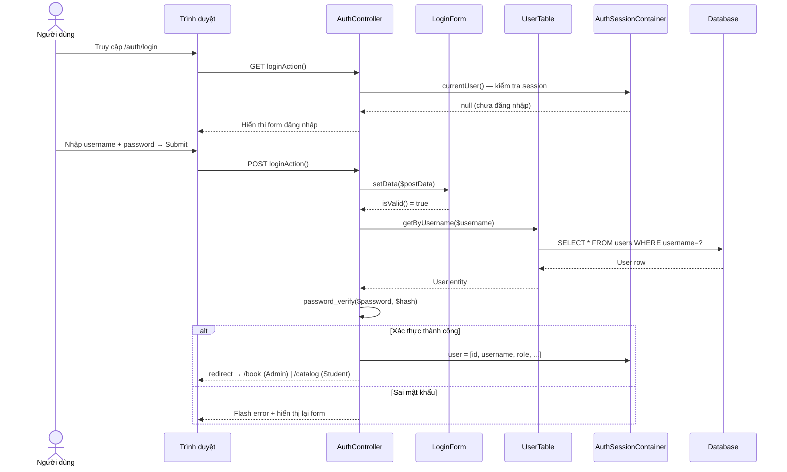
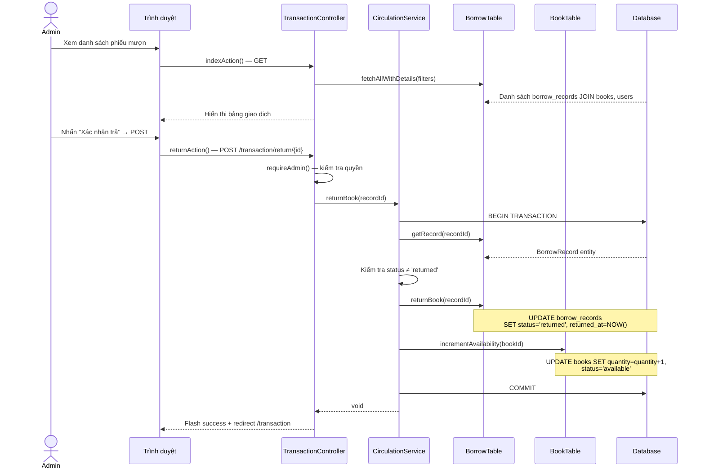
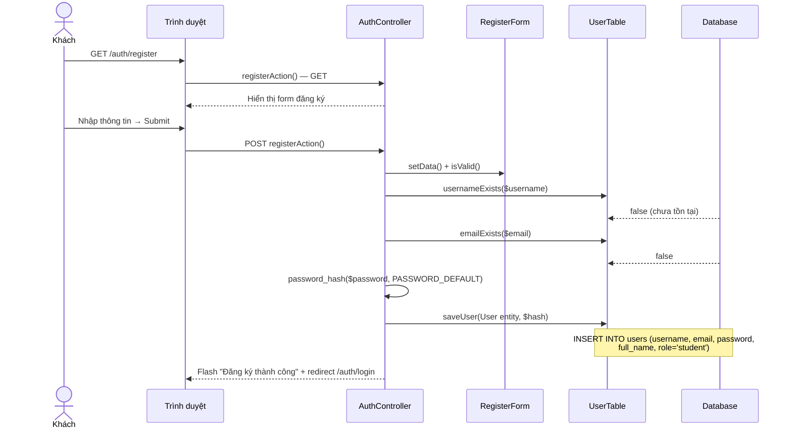
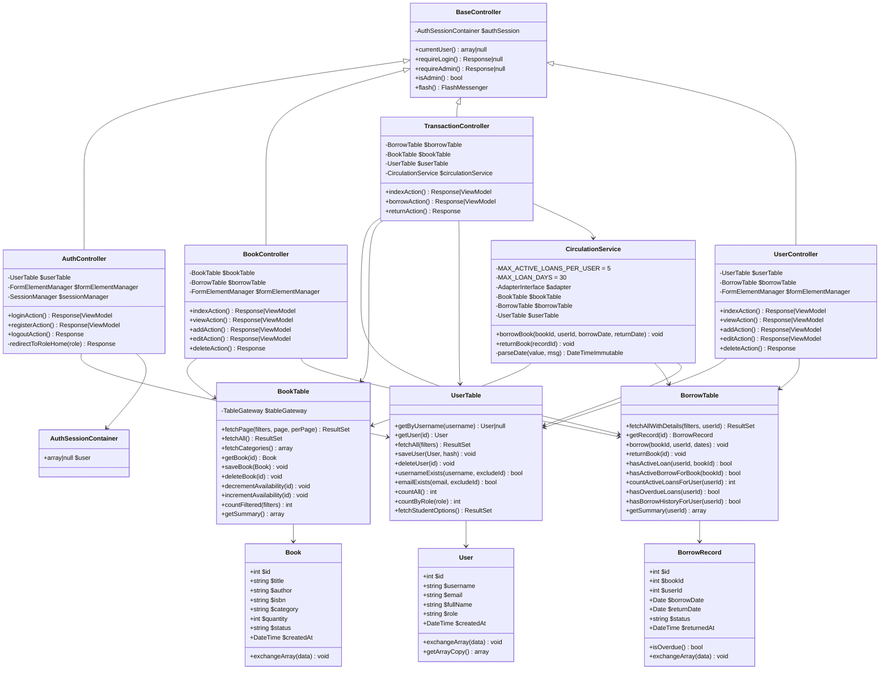
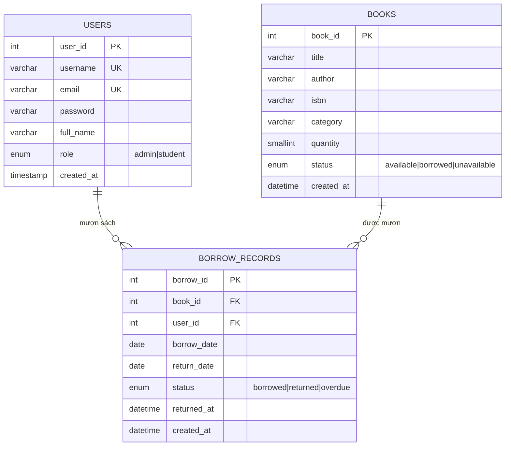
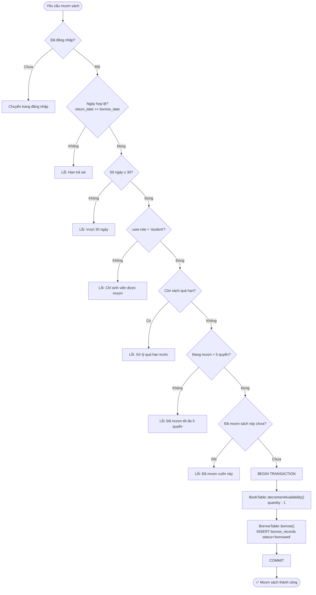
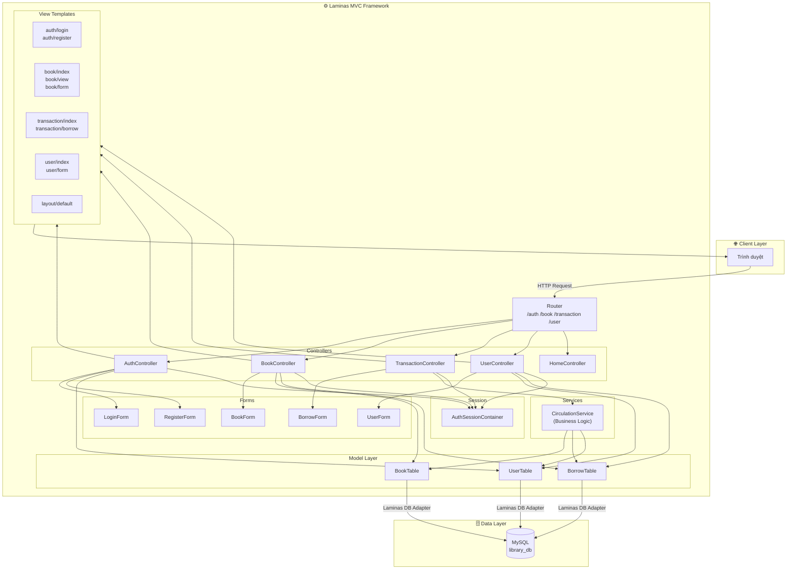
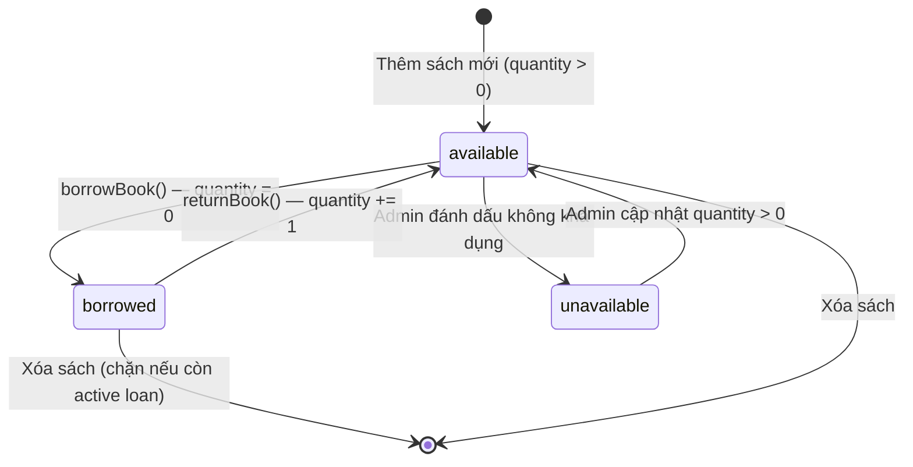
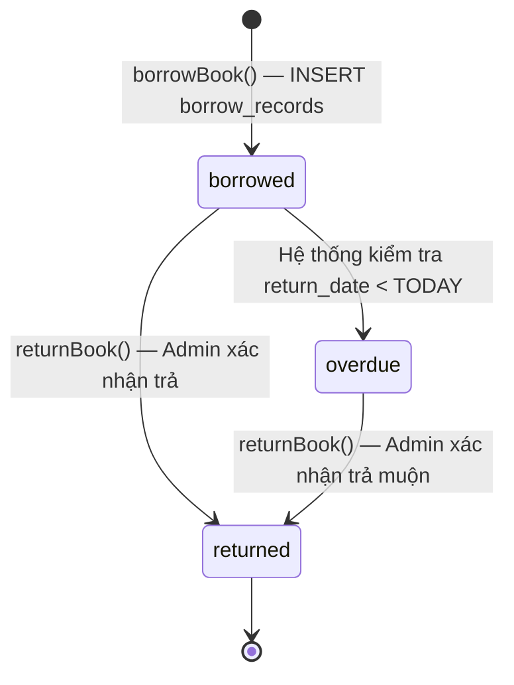

# 📊 Sơ Đồ Hệ Thống — Quản Lý Thư Viện HCMUE

> **Stack:** Laminas (Zend) Framework · PHP · MySQL · MVC Pattern

---

## 1. Use Case Diagram



---

## 2. Sequence Diagram — Đăng nhập



---

## 3. Sequence Diagram — Mượn sách

```mermaid
sequenceDiagram
    actor Actor as Student / Admin
    participant Browser as Trình duyệt
    participant TransCtrl as TransactionController
    participant BorrowForm as BorrowForm
    participant CircSvc as CirculationService
    participant BookTable as BookTable
    participant BorrowTable as BorrowTable
    participant UserTable as UserTable
    participant DB as Database

    Actor->>Browser: GET /transaction/borrow
    Browser->>TransCtrl: borrowAction() — GET
    TransCtrl->>BookTable: fetchAll() — lấy sách còn quantity > 0
    TransCtrl->>UserTable: fetchStudentOptions()
    TransCtrl-->>Browser: Render form mượn sách

    Actor->>Browser: Chọn sách, sinh viên, ngày → Submit
    Browser->>TransCtrl: borrowAction() — POST
    TransCtrl->>BorrowForm: setData() + isValid()
    BorrowForm-->>TransCtrl: valid

    TransCtrl->>CircSvc: borrowBook(bookId, userId, borrowDate, returnDate)
    CircSvc->>CircSvc: Validate ngày (MAX_LOAN_DAYS = 30)
    CircSvc->>UserTable: getUser(userId) — kiểm tra role = student
    CircSvc->>BorrowTable: hasOverdueLoans(userId)
    CircSvc->>BorrowTable: countActiveLoansForUser(userId) — MAX = 5
    CircSvc->>DB: BEGIN TRANSACTION
    CircSvc->>BorrowTable: hasActiveLoan(userId, bookId)
    CircSvc->>BookTable: decrementAvailability(bookId)
    Note over BookTable,DB: UPDATE books SET quantity=quantity-1,<br/>status='borrowed' WHERE book_id=?
    CircSvc->>BorrowTable: borrow(bookId, userId, dates)
    Note over BorrowTable,DB: INSERT INTO borrow_records ...
    CircSvc->>DB: COMMIT

    CircSvc-->>TransCtrl: void (thành công)
    TransCtrl-->>Browser: Flash success + redirect /transaction
```

---

## 4. Sequence Diagram — Trả sách



---

## 5. Sequence Diagram — Đăng ký tài khoản



---

## 6. Class Diagram



---

## 7. Entity-Relationship Diagram (ERD)



---

## 8. Activity Diagram — Luồng mượn sách (Business Rules)



---

## 9. Activity Diagram — Luồng trả sách

```mermaid
flowchart TD
    Start([Admin chọn "Trả sách"]) --> CheckAdmin{isAdmin()?}
    CheckAdmin -- Không --> Forbidden[403 Redirect]
    CheckAdmin -- Đúng --> CheckPost{POST request?}

    CheckPost -- Không --> Redirect[Redirect về danh sách]
    CheckPost -- Đúng --> BeginTx[BEGIN TRANSACTION]

    BeginTx --> GetRecord["BorrowTable::getRecord(id)"]
    GetRecord --> CheckStatus{status = 'returned'?}

    CheckStatus -- Rồi --> ErrReturned[Lỗi: Đã trả trước đó]
    CheckStatus -- Chưa --> UpdateRecord["BorrowTable::returnBook()\nstatus='returned', returned_at=NOW()"]

    UpdateRecord --> IncrBook["BookTable::incrementAvailability()\nquantity + 1"]
    IncrBook --> Commit[COMMIT]
    Commit --> Success([✅ Trả sách thành công])
```

---

## 10. Component Diagram — Kiến trúc hệ thống



---

## 11. State Diagram — Trạng thái sách (Book Status)



---

## 12. State Diagram — Trạng thái phiếu mượn (BorrowRecord Status)



---

## Tóm tắt phân quyền

| Chức năng | Guest | Student | Admin |
|---|:---:|:---:|:---:|
| Xem danh mục sách công khai | ✅ | ✅ | ✅ |
| Đăng nhập / Đăng ký | ✅ | — | — |
| Tìm kiếm & lọc sách | — | ✅ | ✅ |
| Tự đăng ký mượn sách | — | ✅ | — |
| Xem lịch sử mượn cá nhân | — | ✅ | ✅ |
| Quản lý sách (CRUD) | — | — | ✅ |
| Lập phiếu mượn cho sinh viên | — | — | ✅ |
| Xác nhận trả sách | — | — | ✅ |
| Quản lý người dùng (CRUD) | — | — | ✅ |
| Xem tổng quan dashboard | — | — | ✅ |

